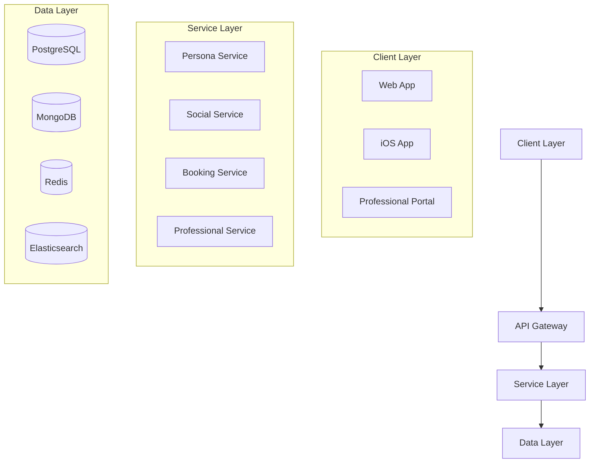
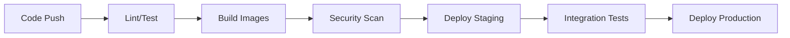

# AI-Enhanced Social Travel Platform

[](https://github.com/your-org/travel-platform/actions)
[](LICENSE)
[](package.json)

<!-- Auto-generated table of contents -->
<!-- markdown-toc start - Don't edit this section. Run M-x markdown-toc-refresh-toc -->

## Table of Contents
- [Introduction](#introduction)
  - [Project Vision](#project-vision)
  - [Key Features](#key-features)
  - [Architecture Overview](#architecture-overview)
- [Getting Started](#getting-started)
  - [Prerequisites](#prerequisites)
  - [Development Environment Setup](#development-environment-setup)
  - [Configuration](#configuration)
- [Project Structure](#project-structure)
  - [Backend Services](#backend-services)
  - [iOS Application](#ios-application)
  - [Web Application](#web-application)
  - [Infrastructure](#infrastructure)
- [Development](#development)
  - [Local Development](#local-development)
  - [Testing](#testing)
  - [Code Style](#code-style)
- [Deployment](#deployment)
  - [Environment Strategy](#environment-strategy)
  - [CI/CD Pipeline](#cicd-pipeline)
  - [Monitoring](#monitoring)
- [Security](#security)
  - [Authentication](#authentication)
  - [Data Protection](#data-protection)
  - [Compliance](#compliance)
- [Maintenance](#maintenance)
  - [Backup Procedures](#backup-procedures)
  - [Disaster Recovery](#disaster-recovery)
  - [Performance Optimization](#performance-optimization)
- [Contributing](#contributing)
- [Support](#support)
- [License](#license)

<!-- markdown-toc end -->

## Introduction

### Project Vision
The AI-Enhanced Social Travel Platform represents a transformative solution in the travel technology landscape, combining artificial intelligence, social networking, and professional services. The platform addresses the fundamental challenge of fragmented travel planning by providing a unified solution where travelers can leverage multiple AI personas for personalized recommendations while engaging in real-time social interactions and accessing professional services.

### Key Features
- Multiple AI personas with real-time learning and adaptation
- Real-time social interactions and collaborative planning
- Professional services marketplace with AI agent monetization
- Seamless integration with Amadeus GDS for reliable bookings
- Advanced security with multi-factor authentication
- Comprehensive analytics and monitoring

### Architecture Overview



## Getting Started

### Prerequisites
- Node.js 18.x LTS
- Docker 20.10.x
- Kubernetes 1.26.x
- AWS CLI 2.x
- Terraform 1.4.x

### Development Environment Setup
1. Clone the repository:
```bash
git clone https://github.com/your-org/travel-platform.git
cd travel-platform
```

2. Install dependencies:
```bash
npm install
```

3. Configure environment variables:
```bash
cp .env.example .env
# Edit .env with your configuration
```

4. Start development environment:
```bash
docker-compose up -d
```

### Configuration
Refer to `config/` directory for environment-specific configurations:
- `config/development.js`
- `config/staging.js`
- `config/production.js`

## Project Structure

### Backend Services
```
src/backend/
├── api-gateway/      # Kong API Gateway configuration
├── booking/          # Travel booking service
├── ml/              # Machine learning service
├── persona/         # AI persona management
├── professional/    # Professional tools service
└── social/          # Real-time social features
```

### iOS Application
```
src/ios/
├── components/      # Reusable React Native components
├── screens/        # Application screens
├── navigation/     # Navigation configuration
└── services/       # API integration services
```

### Web Application
```
src/web/
├── components/     # React components
├── pages/         # Next.js pages
├── public/        # Static assets
└── styles/        # CSS modules and global styles
```

### Infrastructure
```
infrastructure/
├── terraform/     # IaC configurations
├── kubernetes/    # K8s manifests
└── monitoring/    # Prometheus/Grafana setup
```

## Development

### Local Development
1. Start required services:
```bash
docker-compose up -d
```

2. Run development servers:
```bash
# Backend services
cd src/backend
npm run dev

# Web application
cd src/web
npm run dev

# iOS application
cd src/ios
npm run ios
```

### Testing
```bash
# Run all tests
npm test

# Run specific service tests
npm test -- --scope=@travel/booking

# Run with coverage
npm test -- --coverage
```

### Code Style
- ESLint configuration in `.eslintrc.js`
- Prettier configuration in `.prettierrc`
- Pre-commit hooks with Husky

## Deployment

### Environment Strategy
- Development: Local Docker Compose
- Staging: AWS EKS (reduced capacity)
- Production: Multi-region AWS EKS
- DR Site: Cross-region failover

### CI/CD Pipeline


### Monitoring
- Prometheus for metrics collection
- Grafana for visualization
- ELK Stack for log aggregation
- Custom dashboards for business metrics

## Security

### Authentication
- OAuth 2.0 + JWT for user authentication
- API Keys for professional access
- MFA for high-value transactions

### Data Protection
- AES-256-GCM encryption at rest
- TLS 1.3 for data in transit
- Regular security audits

### Compliance
- GDPR compliance measures
- PCI DSS for payment processing
- SOC 2 certification

## Maintenance

### Backup Procedures
- Automated daily backups
- Point-in-time recovery
- Cross-region replication

### Disaster Recovery
- RPO: 1 hour
- RTO: 4 hours
- Regular DR testing

### Performance Optimization
- Regular performance audits
- Automated scaling policies
- Cache optimization

## Contributing
Please read [CONTRIBUTING.md](CONTRIBUTING.md) for details on our code of conduct and the process for submitting pull requests.

## Support
For support, please contact:
- Technical Issues: tech-support@platform.com
- Security Concerns: security@platform.com
- General Inquiries: support@platform.com

## License
This project is licensed under the MIT License - see the [LICENSE](LICENSE) file for details.