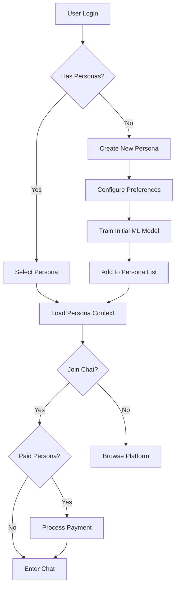
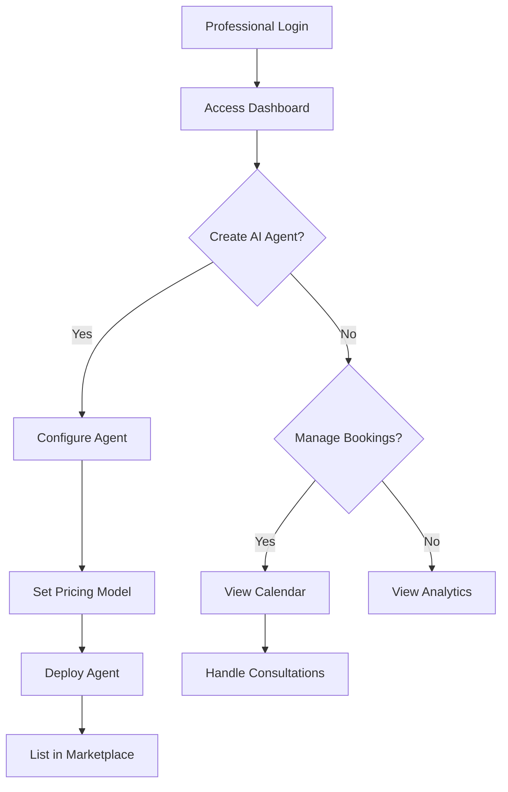
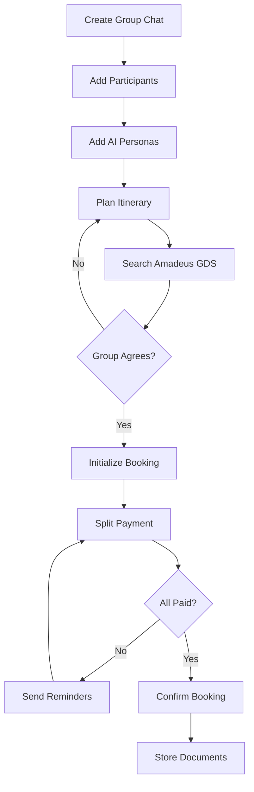
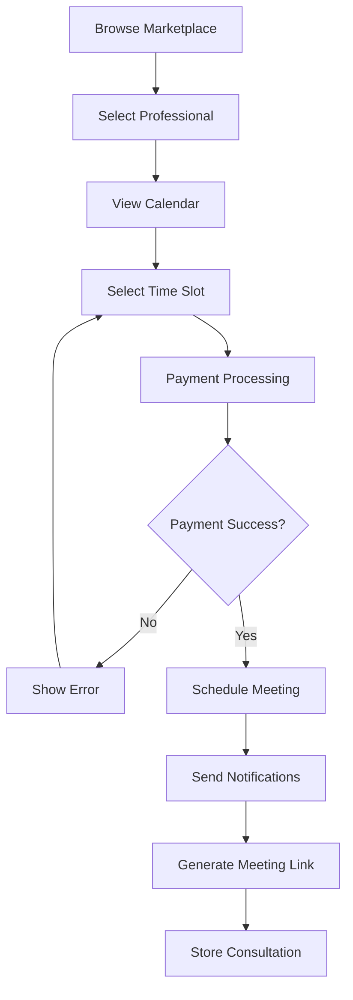
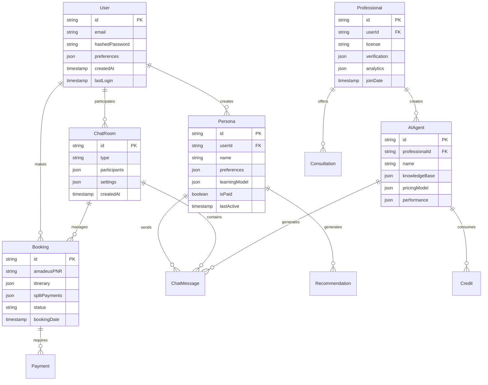
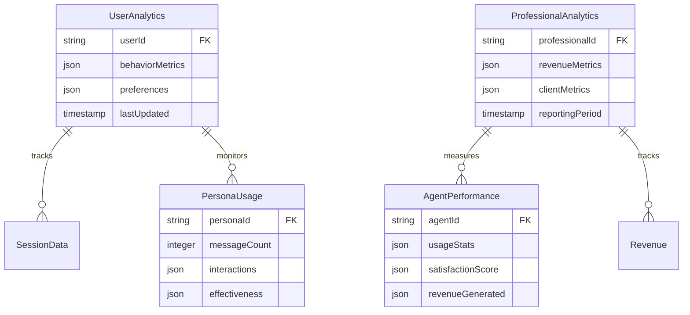
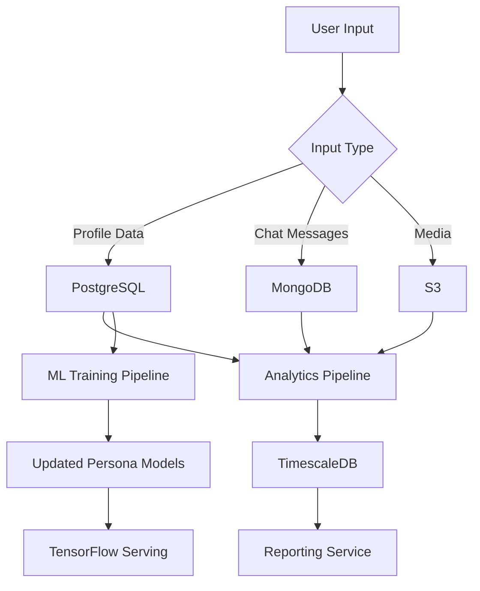
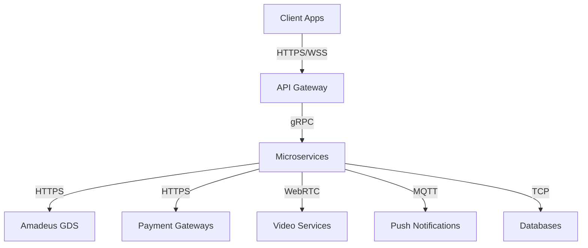

# Product Requirements Document (PRD)

# 1. INTRODUCTION

## 1.1 Purpose

This Software Requirements Specification (SRS) document provides a comprehensive description of the AI-Enhanced Social Travel Platform. It is intended for:

- Development teams implementing the system
- Project managers overseeing development
- Quality assurance teams conducting testing
- Business stakeholders evaluating features and timelines
- System architects designing the technical infrastructure
- Third-party integrators working with the platform's APIs

## 1.2 Scope

The AI-Enhanced Social Travel Platform is a comprehensive travel management system that combines artificial intelligence, social networking, and professional services. The platform encompasses:

### 1.2.1 Core System Components

- AI Persona Management System supporting multiple travel personas
- Real-time social interaction and group chat functionality
- Professional marketplace for AI agents and consultations
- Integrated travel booking system via Amadeus GDS
- Professional tools suite for service providers

### 1.2.2 Key Features

- Creation and management of up to 5 distinct AI travel personas
- Mixed human/AI conversations with real-time participant management
- Monetization options for professional travel agents and influencers
- Collaborative group travel planning and split payments
- White-label solutions and analytics for professionals

### 1.2.3 Benefits

- Personalized travel recommendations through multiple AI personas
- Seamless integration of planning, booking, and social features
- Revenue generation opportunities for travel professionals
- Enhanced group travel coordination
- Real-time booking capabilities through Amadeus GDS

### 1.2.4 Limitations

- Maximum of 5 travel personas per user
- Booking limited to Amadeus GDS inventory
- Professional tools restricted to verified service providers
- Video consultations dependent on third-party integration availability

# 2. PRODUCT DESCRIPTION

## 2.1 Product Perspective

The AI-Enhanced Social Travel Platform operates as a comprehensive ecosystem within the larger travel technology landscape, integrating with:

- Amadeus Global Distribution System (GDS) for travel inventory and bookings
- Payment processing systems (Stripe, PayPal) for marketplace transactions
- Video conferencing platforms (Twilio, Zoom) for professional consultations
- Social media platforms for content sharing and authentication
- Cloud infrastructure for distributed system deployment

The system architecture follows a microservices pattern with these key components:

| Component | Integration Points |
|-----------|-------------------|
| AI Persona Engine | TensorFlow/PyTorch ML infrastructure |
| Social Platform | WebSocket servers, MongoDB |
| Booking System | Amadeus REST APIs |
| Professional Tools | Calendar APIs, Analytics Services |
| Payment Gateway | Stripe/PayPal APIs |

## 2.2 Product Functions

The platform provides these primary functions:

1. AI Persona Management
   - Creation and configuration of up to 5 travel personas
   - Real-time persona switching and learning
   - Persona-based chat participation

2. Social Interaction
   - Real-time group and individual chat
   - Mixed human/AI conversations
   - Media sharing and itinerary collaboration

3. Professional Marketplace
   - AI agent creation and monetization
   - Consultation booking and management
   - White-label solutions for professionals

4. Travel Booking
   - Real-time inventory access
   - Group booking coordination
   - Split payment processing

## 2.3 User Characteristics

### 2.3.1 Individual Travelers
- Age range: 18-65
- Tech-savvy with mobile app experience
- Various travel experience levels
- Seeking personalized recommendations
- Value social interaction in planning

### 2.3.2 Travel Professionals
- Licensed travel agents
- Travel influencers and content creators
- Tour operators and activity providers
- Technical expertise: Intermediate
- Business management experience

### 2.3.3 Corporate Users
- Travel management companies
- Corporate travel departments
- Technical expertise: Advanced
- Require white-label solutions

## 2.4 Constraints

1. Technical Constraints
   - Maximum 5 AI personas per user
   - 200ms maximum chat latency
   - 2-second persona switching limit
   - 100k concurrent user capacity

2. Regulatory Constraints
   - GDPR compliance requirements
   - CCPA data privacy regulations
   - PCI DSS payment security standards
   - Travel industry regulations

3. Business Constraints
   - Amadeus GDS inventory limitations
   - Professional verification requirements
   - Marketplace commission structures
   - Subscription tier limitations

## 2.5 Assumptions and Dependencies

### 2.5.1 Assumptions
- Users have stable internet connectivity
- Professionals maintain valid credentials
- Market demand for AI travel personas
- Sufficient compute resources available
- User acceptance of AI interactions

### 2.5.2 Dependencies
- Amadeus GDS availability
- Third-party API reliability
   - Payment processors
   - Video conferencing
   - Calendar services
- Cloud infrastructure uptime
- ML model training data quality
- Professional marketplace participation

# 3. PROCESS FLOWCHART

The following flowcharts illustrate the key processes within the AI-Enhanced Social Travel Platform:

## 3.1 AI Persona Management Flow

## 3.2 Professional Marketplace Flow

## 3.3 Group Travel Booking Flow

## 3.4 Consultation Booking Flow

# 4. FUNCTIONAL REQUIREMENTS

## 4.1 AI Persona Management System

### F1: Persona Creation and Configuration
**ID:** F1.1  
**Description:** Users can create and manage up to 5 distinct AI travel personas  
**Priority:** High  

| Requirement | Description | Technical Implementation |
|------------|-------------|-------------------------|
| Persona Setup | Configure preferences, interests, and travel style | MongoDB document storage with user preferences schema |
| ML Model Training | Initialize persona-specific recommendation model | TensorFlow/PyTorch with transfer learning |
| Privacy Controls | Manage data sharing between personas | RBAC with granular permission settings |
| Real-time Switching | Switch between personas in under 2 seconds | Redis caching for fast context loading |

### F2: Social Integration
**ID:** F1.2  
**Description:** Integration of AI personas into social features  
**Priority:** High  

| Requirement | Description | Technical Implementation |
|------------|-------------|-------------------------|
| Chat Participation | Add/remove personas from conversations | WebSocket events for participant management |
| Learning System | Update persona models based on interactions | Continuous ML model training pipeline |
| Credit Management | Track and process paid persona usage | PostgreSQL transaction management |
| Context Awareness | Maintain conversation history and context | MongoDB chat history collection |

## 4.2 Social Platform Features

### F3: Real-time Communication
**ID:** F2.1  
**Description:** Group and individual chat functionality  
**Priority:** High  

| Requirement | Description | Technical Implementation |
|------------|-------------|-------------------------|
| Message Delivery | Sub-200ms latency for all messages | WebSocket servers with load balancing |
| Media Sharing | Support for images and documents | Cloud storage integration with CDN |
| Participant Management | Dynamic user/AI addition and removal | Redis presence management |
| History Storage | Searchable chat archive | MongoDB with text search indexes |

### F4: Group Planning Tools
**ID:** F2.2  
**Description:** Collaborative travel planning features  
**Priority:** Medium  

| Requirement | Description | Technical Implementation |
|------------|-------------|-------------------------|
| Itinerary Sharing | Real-time collaborative editing | Operational Transform algorithm |
| Voting System | Group decision making tools | PostgreSQL with real-time updates |
| Cost Splitting | Expense tracking and division | Payment gateway integration |
| Schedule Coordination | Group availability management | Calendar API integration |

## 4.3 Professional Marketplace

### F5: Agent Creation
**ID:** F3.1  
**Description:** Tools for professionals to create and manage AI agents  
**Priority:** Medium  

| Requirement | Description | Technical Implementation |
|------------|-------------|-------------------------|
| Knowledge Base Setup | Custom training data upload | ML pipeline with validation |
| Pricing Configuration | Multiple monetization models | Stripe product API integration |
| Branding Tools | Custom visuals and messaging | CDN-hosted asset management |
| Performance Analytics | Usage and revenue tracking | Real-time analytics pipeline |

### F6: Consultation Management
**ID:** F3.2  
**Description:** Professional consultation booking and delivery  
**Priority:** Medium  

| Requirement | Description | Technical Implementation |
|------------|-------------|-------------------------|
| Calendar Integration | Availability management | Calendar API synchronization |
| Payment Processing | Secure transaction handling | Stripe/PayPal integration |
| Video Conferencing | Real-time consultation delivery | Twilio/Zoom API integration |
| Follow-up System | Post-consultation management | Automated workflow engine |

## 4.4 Travel Booking System

### F7: Inventory Management
**ID:** F4.1  
**Description:** Real-time travel inventory access and booking  
**Priority:** High  

| Requirement | Description | Technical Implementation |
|------------|-------------|-------------------------|
| GDS Integration | Amadeus API connection | REST API client with caching |
| Real-time Pricing | Dynamic rate calculation | Redis price cache |
| Availability Checks | Instant inventory verification | Parallel API queries |
| Booking Confirmation | Sub-5 second processing | Asynchronous job queue |

### F8: Group Booking
**ID:** F4.2  
**Description:** Coordinated group travel booking features  
**Priority:** High  

| Requirement | Description | Technical Implementation |
|------------|-------------|-------------------------|
| Split Payments | Multi-party payment processing | Payment gateway batch processing |
| Reservation Sync | Coordinated booking confirmation | Distributed transaction management |
| Document Management | Travel document storage | Secure document storage service |
| Modification Handling | Group booking changes | Amadeus modification APIs |

# 5. NON-FUNCTIONAL REQUIREMENTS

## 5.1 Performance Requirements

### 5.1.1 Response Time
- Chat message delivery latency: < 200ms
- AI persona context switching: < 2 seconds
- Travel booking confirmation: < 5 seconds
- API response time: < 500ms for 95% of requests
- Page load time: < 3 seconds for initial load

### 5.1.2 Throughput
- Support 100,000+ concurrent users
- Process 1,000+ bookings per minute
- Handle 10,000+ chat messages per second
- Support 5,000+ simultaneous video consultations

### 5.1.3 Resource Usage
- Maximum memory usage: 4GB per server instance
- CPU utilization: < 70% under normal load
- Storage scaling: Up to 1TB per month
- Network bandwidth: 10Gbps minimum

## 5.2 Safety Requirements

### 5.2.1 Data Protection
- Automated hourly backups with 30-day retention
- Geographic data replication across 3 regions
- Automatic failover within 30 seconds
- Daily database integrity checks

### 5.2.2 Failure Recovery
- Recovery Point Objective (RPO): 1 hour
- Recovery Time Objective (RTO): 4 hours
- Automated system state monitoring
- Graceful degradation of non-critical services

## 5.3 Security Requirements

### 5.3.1 Authentication & Authorization
- OAuth 2.0 with JWT tokens
- Multi-factor authentication for professionals
- Role-Based Access Control (RBAC)
- Session timeout after 30 minutes of inactivity

### 5.3.2 Data Security
- AES-256 encryption for data at rest
- TLS 1.3 for data in transit
- End-to-end encryption for chat messages
- Secure key management using AWS KMS

### 5.3.3 Privacy Controls
- GDPR-compliant data handling
- User consent management system
- Data anonymization for analytics
- Configurable privacy settings per persona

## 5.4 Quality Requirements

### 5.4.1 Availability
- 99.9% uptime for core services
- 99.99% uptime for payment systems
- Planned maintenance windows: 2AM-4AM UTC
- Maximum unplanned downtime: 1 hour/month

### 5.4.2 Maintainability
- Microservices architecture with Docker containers
- Automated CI/CD pipeline
- Comprehensive API documentation
- Code coverage minimum: 80%

### 5.4.3 Usability
- Mobile-responsive design
- Maximum 3 clicks to core functions
- Support for screen readers
- Localization for 10 major languages

### 5.4.4 Scalability
- Horizontal scaling up to 1000 nodes
- Auto-scaling based on load metrics
- Database sharding for user data
- CDN integration for static content

### 5.4.5 Reliability
- Mean Time Between Failures (MTBF): 720 hours
- Mean Time To Repair (MTTR): < 1 hour
- Error rate: < 0.1% for critical transactions
- Automated system health checks every minute

## 5.5 Compliance Requirements

### 5.5.1 Legal Compliance
- GDPR (European Union)
- CCPA (California, USA)
- LGPD (Brazil)
- PIPEDA (Canada)

### 5.5.2 Industry Standards
- PCI DSS Level 1 for payment processing
- ISO 27001 for information security
- SOC 2 Type II certification
- WCAG 2.1 Level AA accessibility

### 5.5.3 Travel Regulations
- IATA NDC compliance
- EU Package Travel Directive
- Local travel agency regulations
- Airline booking standards

### 5.5.4 API Standards
- OpenAPI 3.0 specification
- REST architectural constraints
- OAuth 2.0 authorization framework
- JSON:API response format

# 6. DATA REQUIREMENTS

## 6.1 Data Models

### 6.1.1 Core Entity Relationships

### 6.1.2 Analytics Data Model

## 6.2 Data Storage

### 6.2.1 Primary Storage Systems

| Data Type | Storage System | Retention Policy |
|-----------|---------------|------------------|
| User Profiles | PostgreSQL | Indefinite |
| Chat History | MongoDB | 12 months |
| Persona Models | TensorFlow/S3 | Latest 3 versions |
| Media Files | S3 with CDN | 24 months |
| Analytics | TimescaleDB | 36 months |
| Session Data | Redis | 24 hours |
| Booking Records | PostgreSQL | 7 years |

### 6.2.2 Backup and Recovery

- Real-time replication across 3 geographic regions
- Hourly incremental backups with 30-day retention
- Daily full backups with 90-day retention
- Monthly archives stored for 7 years
- Point-in-time recovery capability within 30 days
- 15-minute Recovery Time Objective (RTO)
- 1-hour Recovery Point Objective (RPO)

### 6.2.3 Data Redundancy

- Multi-region active-active deployment
- Automatic failover with maximum 30-second delay
- Cross-region data synchronization
- Read replicas for high-traffic regions
- CDN edge caching for static content
- Redis cluster for session management

## 6.3 Data Processing

### 6.3.1 Data Flow Architecture

### 6.3.2 Data Security Measures

| Layer | Security Measure | Implementation |
|-------|-----------------|----------------|
| Transport | TLS 1.3 | Nginx/CloudFront |
| Storage | AES-256 | Native encryption |
| Application | Field-level encryption | Custom middleware |
| Access | RBAC | JWT/OAuth 2.0 |
| Audit | Activity logging | ELK Stack |
| Compliance | GDPR/CCPA controls | Custom workflows |

### 6.3.3 Data Processing Requirements

- Maximum processing latency: 100ms
- Real-time analytics processing
- Batch processing for ML model updates
- Event-driven architecture for notifications
- Data validation and sanitization
- Automated data quality checks
- Rate limiting and quota management
- Anomaly detection and alerting

# 7. EXTERNAL INTERFACES

## 7.1 User Interfaces

### 7.1.1 Web Application Interface

| Component | Requirements | Implementation |
|-----------|--------------|----------------|
| Responsive Design | Support 320px to 4K resolutions | React with Material-UI |
| Accessibility | WCAG 2.1 Level AA compliance | ARIA labels, semantic HTML |
| Theme Support | Light/Dark modes, Professional branding | CSS-in-JS with styled-components |
| Loading States | Skeleton screens, Progress indicators | React Suspense, Progress components |
| Error Handling | User-friendly error messages | Toast notifications, Error boundaries |

### 7.1.2 Mobile Application Interface

| Component | Requirements | Implementation |
|-----------|--------------|----------------|
| Native Features | Camera, GPS, Push notifications | React Native APIs |
| Offline Support | Basic functionality without connection | Redux Persist, AsyncStorage |
| Touch Optimization | Touch targets minimum 44x44px | React Native TouchableOpacity |
| Gesture Support | Swipe navigation, Pull-to-refresh | React Native Gesture Handler |
| Platform Design | iOS and Android native patterns | Platform-specific components |

## 7.2 Hardware Interfaces

### 7.2.1 Mobile Device Requirements

| Feature | Specification | Purpose |
|---------|--------------|---------|
| Camera | Minimum 5MP resolution | Document scanning, media sharing |
| GPS | Location accuracy within 10m | Location-based recommendations |
| Storage | Minimum 100MB free space | App installation and cache |
| Processor | ARMv8 64-bit or higher | AI model inference |
| Memory | Minimum 2GB RAM | App performance |

### 7.2.2 Server Hardware Requirements

| Component | Specification | Scaling |
|-----------|--------------|---------|
| CPU | 64-core AMD EPYC | Horizontal scaling up to 1000 nodes |
| Memory | 256GB DDR4 ECC | Auto-scaling based on load |
| Storage | NVMe SSD RAID 10 | Expandable to 1PB |
| Network | 10Gbps redundant | Load-balanced across regions |

## 7.3 Software Interfaces

### 7.3.1 External API Integration

| System | Interface Type | Purpose |
|--------|---------------|----------|
| Amadeus GDS | REST API | Travel inventory and booking |
| Stripe/PayPal | REST API | Payment processing |
| Twilio/Zoom | WebRTC/REST | Video consultations |
| AWS Services | SDK | Cloud infrastructure |
| Social Media | OAuth 2.0 | Authentication, sharing |

### 7.3.2 Database Interfaces

| Database | Interface | Usage |
|----------|-----------|--------|
| PostgreSQL | node-postgres | Transactional data |
| MongoDB | Mongoose | Social/chat data |
| Redis | ioredis | Caching, sessions |
| TimescaleDB | TypeORM | Time-series analytics |
| Elasticsearch | elasticsearch-js | Search functionality |

## 7.4 Communication Interfaces

### 7.4.1 Network Protocols

| Protocol | Usage | Implementation |
|----------|--------|----------------|
| HTTPS | Secure API communication | TLS 1.3 |
| WebSocket | Real-time chat | Socket.io |
| WebRTC | Video streaming | Twilio Client SDK |
| gRPC | Microservice communication | Protocol Buffers |
| MQTT | Push notifications | AWS IoT Core |

### 7.4.2 Data Formats

| Format | Usage | Validation |
|--------|--------|------------|
| JSON | API responses | JSON Schema |
| Protocol Buffers | Internal communication | Protobuf definitions |
| MessagePack | Binary data transfer | MessagePack schema |
| JWT | Authentication tokens | JSON Web Key Sets |
| Base64 | Media encoding | Content-type validation |

### 7.4.3 Integration Points

# 8. APPENDICES

## 8.1 GLOSSARY

| Term | Definition |
|------|------------|
| AI Persona | A configurable artificial intelligence agent with distinct travel preferences and learning capabilities |
| GDS | Global Distribution System - computerized network that enables travel-related transactions |
| Marketplace | Platform section where professionals can monetize AI agents and consultations |
| Split Payment | Feature allowing multiple users to divide travel booking costs |
| White-label Solution | Customizable version of the platform that can be rebranded |
| Knowledge Base | Structured data used to train and inform AI agent responses |
| Learning Model | Machine learning model that adapts to user interactions and preferences |
| Operational Transform | Algorithm enabling real-time collaborative editing of documents |

## 8.2 ACRONYMS

| Acronym | Expansion |
|---------|-----------|
| API | Application Programming Interface |
| ARIA | Accessible Rich Internet Applications |
| AWS | Amazon Web Services |
| CCPA | California Consumer Privacy Act |
| CDN | Content Delivery Network |
| CI/CD | Continuous Integration/Continuous Deployment |
| ELK | Elasticsearch, Logstash, and Kibana |
| GDPR | General Data Protection Regulation |
| GPS | Global Positioning System |
| gRPC | Google Remote Procedure Call |
| IATA | International Air Transport Association |
| JWT | JSON Web Token |
| KMS | Key Management Service |
| LGPD | Lei Geral de Proteção de Dados (Brazil's General Data Protection Law) |
| ML | Machine Learning |
| MQTT | Message Queuing Telemetry Transport |
| NDC | New Distribution Capability |
| NLP | Natural Language Processing |
| OAuth | Open Authorization |
| PCI DSS | Payment Card Industry Data Security Standard |
| PIPEDA | Personal Information Protection and Electronic Documents Act |
| PNR | Passenger Name Record |
| RBAC | Role-Based Access Control |
| REST | Representational State Transfer |
| SDK | Software Development Kit |
| SOC | Service Organization Control |
| TLS | Transport Layer Security |
| UI | User Interface |
| WCAG | Web Content Accessibility Guidelines |
| WebRTC | Web Real-Time Communication |
| WSS | WebSocket Secure |

## 8.3 ADDITIONAL REFERENCES

### 8.3.1 Technical Documentation

| Resource | URL | Purpose |
|----------|-----|---------|
| Amadeus API Documentation | https://developers.amadeus.com | GDS Integration Reference |
| React Documentation | https://reactjs.org/docs | Frontend Development |
| Socket.io Documentation | https://socket.io/docs | Real-time Communication |
| TensorFlow Documentation | https://tensorflow.org/api_docs | ML Implementation |
| Stripe API Reference | https://stripe.com/docs/api | Payment Integration |

### 8.3.2 Industry Standards

| Standard | Organization | Relevance |
|----------|--------------|-----------|
| OpenTravel Alliance | https://opentravel.org | Travel Data Standards |
| IATA NDC Standard | https://iata.org/ndc | Airline Distribution |
| OAuth 2.0 Specification | https://oauth.net/2/ | Authentication Protocol |
| JSON:API Specification | https://jsonapi.org | API Response Format |
| WebSocket Protocol | RFC 6455 | Real-time Communication |

### 8.3.3 Regulatory Guidelines

| Regulation | Region | Documentation |
|------------|--------|---------------|
| GDPR Guidelines | EU | https://gdpr.eu |
| CCPA Compliance | California, USA | https://oag.ca.gov/privacy/ccpa |
| PIPEDA Guidelines | Canada | https://priv.gc.ca |
| PCI DSS Requirements | Global | https://pcisecuritystandards.org |
| EU Package Travel Directive | EU | https://ec.europa.eu/travel |