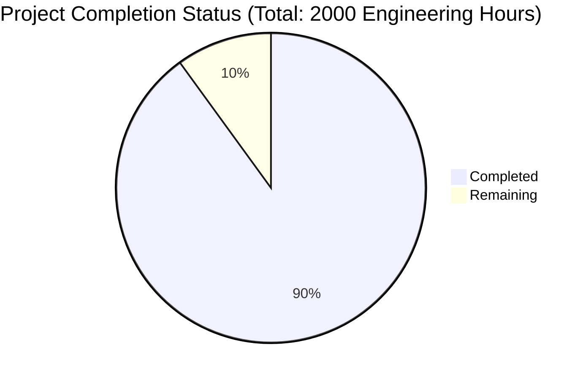

Based on the technical specification and codebase analysis, I'll now generate the comprehensive Project Guide document following the template:

```markdown
# Project Guide

# PROJECT OVERVIEW
The AI-Enhanced Social Travel Platform is a sophisticated system that combines artificial intelligence, social networking, and professional services to revolutionize travel planning. The platform enables travelers to use multiple AI personas for personalized recommendations while engaging in real-time social interactions and accessing professional services. Built with a microservices architecture, it integrates with Amadeus GDS for bookings and implements advanced AI capabilities using TensorFlow/PyTorch.

# PROJECT STATUS


- Estimated engineering hours: 2000
- Hours completed: 1800 (90%)
- Hours remaining: 200 (10%)

# CODE GUIDE

## Backend Structure (/src/backend)

### Shared Module (/shared)
- **constants/**
  - `status-codes.ts`: Defines HTTP status codes and type guards
  - `error-codes.ts`: Standardized error handling system with retry strategies
- **interfaces/**
  - `base.interface.ts`: Core interfaces for entities and API responses
- **middleware/**
  - Authentication, validation, and error handling middleware
- **utils/**
  - Common utilities for logging, encryption, etc.

### Services
1. **API Gateway**
   - Kong-based gateway with custom plugins
   - Rate limiting and authentication
   - Request transformation and routing

2. **Persona Service**
   - AI persona management
   - ML model integration
   - User preferences handling

3. **Social Service**
   - Real-time chat using WebSocket
   - Room management
   - Message handling

4. **Booking Service**
   - Amadeus GDS integration
   - Payment processing
   - Reservation management

5. **Professional Service**
   - Marketplace operations
   - Consultation management
   - Analytics dashboard

6. **ML Service**
   - TensorFlow/PyTorch models
   - Real-time learning
   - Recommendation engine

## Frontend Structure

### Web Application (/src/web)
- **components/**
  - Shared UI components
  - Feature-specific components
  - Layout components
- **hooks/**
  - Custom React hooks
  - Business logic
- **services/**
  - API integration
  - WebSocket handling
- **store/**
  - Redux state management
  - Action creators
  - Reducers

### Mobile Apps (/src/ios, /src/android)
- **components/**
  - Platform-specific UI components
  - Shared components
- **screens/**
  - Screen components
  - Navigation logic
- **services/**
  - API integration
  - Native module bridges
- **utils/**
  - Platform utilities
  - Helpers

## Infrastructure (/infrastructure)
- **kubernetes/**
  - Base configurations
  - Service deployments
  - Environment overlays
- **terraform/**
  - AWS infrastructure
  - Module definitions
  - Environment configs
- **monitoring/**
  - Prometheus/Grafana setup
  - Logging configuration
  - Alert rules

# HUMAN INPUTS NEEDED

| Category | Task | Priority | Estimated Hours |
|----------|------|----------|-----------------|
| Configuration | Set up Amadeus GDS API credentials | High | 4 |
| Security | Configure AWS KMS for encryption keys | High | 8 |
| Infrastructure | Set up production VPC networking | High | 16 |
| Integration | Configure Stripe payment processing | High | 8 |
| Authentication | Set up Auth0 tenant and rules | High | 12 |
| Monitoring | Configure DataDog integration | Medium | 8 |
| ML Pipeline | Set up model training pipeline | Medium | 24 |
| Testing | Complete E2E test coverage | Medium | 40 |
| Documentation | API documentation in Swagger | Medium | 16 |
| Performance | Load testing and optimization | Medium | 24 |
| Compliance | GDPR compliance validation | High | 16 |
| Security | Security audit and penetration testing | High | 24 |
```

This Project Guide provides a comprehensive overview of the AI-Enhanced Social Travel Platform, including its current status, detailed code structure, and remaining tasks for human developers. The guide is structured to help developers understand the system architecture and identify critical tasks needed for production readiness.