# Technical Specifications

# 1. INTRODUCTION

## 1.1 EXECUTIVE SUMMARY

The AI-Enhanced Social Travel Platform represents a transformative solution in the travel technology landscape, combining artificial intelligence, social networking, and professional services. The system addresses the fundamental challenge of fragmented travel planning by providing a unified platform where travelers can leverage multiple AI personas for personalized recommendations while engaging in real-time social interactions and accessing professional services.

This platform serves individual travelers seeking personalized experiences, travel professionals looking to monetize their expertise, and corporate users requiring white-label solutions. By integrating Amadeus GDS for reliable bookings, implementing advanced AI for personalization, and providing comprehensive social features, the system is positioned to deliver significant value through improved travel planning efficiency and enhanced revenue opportunities for professionals.

## 1.2 SYSTEM OVERVIEW

### Project Context

| Aspect | Description |
|--------|-------------|
| Market Position | Premium travel platform focusing on AI-driven personalization and social collaboration |
| Current Limitations | Replaces disconnected tools for planning, booking, and social sharing |
| Enterprise Integration | Interfaces with Amadeus GDS, payment processors, and professional tools |

### High-Level Description

| Component | Implementation |
|-----------|----------------|
| AI Persona System | TensorFlow/PyTorch-based learning models with real-time adaptation |
| Social Platform | WebSocket-powered real-time communication with mixed human/AI interactions |
| Professional Tools | White-label solutions with marketplace integration and analytics |
| Booking Engine | Amadeus GDS integration with split payment support |

### Success Criteria

| Metric | Target |
|--------|---------|
| User Adoption | 100,000+ active users within 6 months |
| Platform Performance | 99.9% uptime, <200ms chat latency |
| Revenue Generation | $1M+ monthly marketplace transactions |
| User Satisfaction | 4.5+ average rating across all features |

## 1.3 SCOPE

### In-Scope Elements

#### Core Features

| Feature Category | Components |
|-----------------|------------|
| AI Capabilities | - Multiple persona management (up to 5 per user)<br>- Real-time learning and adaptation<br>- Natural language processing for chat |
| Social Features | - Group/individual chat<br>- Mixed human/AI conversations<br>- Collaborative planning tools |
| Professional Tools | - AI agent creation and monetization<br>- Consultation management<br>- Analytics dashboard |
| Booking System | - Real-time inventory access<br>- Group booking coordination<br>- Split payment processing |

#### Implementation Boundaries

| Boundary Type | Coverage |
|--------------|----------|
| User Groups | Individual travelers, professionals, corporate clients |
| Geographic Scope | Global platform with multi-language support |
| Data Domains | Travel preferences, social interactions, booking records |
| Technical Coverage | Web platform, iOS/Android mobile apps |

### Out-of-Scope Elements

- Offline booking capabilities
- Direct supplier relationships outside Amadeus GDS
- Hardware-specific optimizations
- Custom payment gateway integrations
- Third-party loyalty program integration
- Manual travel agent services
- Legacy system migrations
- Blockchain-based features

# 2. SYSTEM ARCHITECTURE

## 2.1 High-Level Architecture

### 2.1.1 System Context (C4 Level 0)

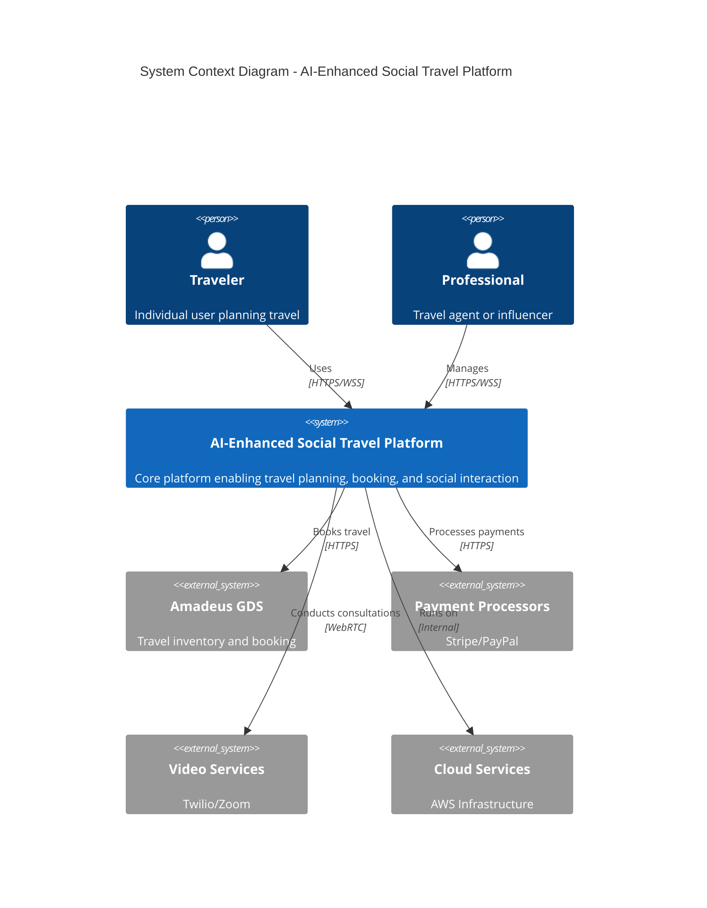

### 2.1.2 Container Architecture (C4 Level 1)

```mermaid
C4Container
    title Container Diagram - Platform Components
    
    Container(web, "Web Application", "React", "Browser-based user interface")
    Container(mobile, "Mobile Apps", "React Native", "iOS/Android applications")
    Container(api, "API Gateway", "Kong", "API management and routing")
    
    Container_Boundary(services, "Microservices") {
        Container(persona, "Persona Service", "Node.js", "AI persona management")
        Container(social, "Social Service", "Node.js", "Chat and collaboration")
        Container(booking, "Booking Service", "Node.js", "Travel reservations")
        Container(pro, "Professional Service", "Node.js", "Marketplace and tools")
    }
    
    Container_Boundary(data, "Data Layer") {
        ContainerDb(postgres, "PostgreSQL", "Primary data store")
        ContainerDb(mongo, "MongoDB", "Social/chat data")
        ContainerDb(redis, "Redis", "Caching/sessions")
        ContainerDb(elastic, "Elasticsearch", "Search/analytics")
    }
    
    Rel(web, api, "Uses", "HTTPS")
    Rel(mobile, api, "Uses", "HTTPS")
    Rel(api, services, "Routes to", "gRPC")
    Rel(services, data, "Reads/writes", "TCP")
```

## 2.2 Component Details

### 2.2.1 Core Components

| Component | Technology Stack | Purpose | Scaling Strategy |
|-----------|-----------------|---------|------------------|
| API Gateway | Kong, Nginx | Request routing, auth, rate limiting | Horizontal with load balancing |
| Persona Service | Node.js, TensorFlow | AI persona management | Vertical for ML, horizontal for API |
| Social Service | Node.js, Socket.io | Real-time communication | Horizontal with sticky sessions |
| Booking Service | Node.js, Amadeus SDK | Travel reservations | Horizontal with distributed locking |
| Professional Service | Node.js, Express | Marketplace operations | Horizontal with shared nothing |

### 2.2.2 Data Flow Architecture

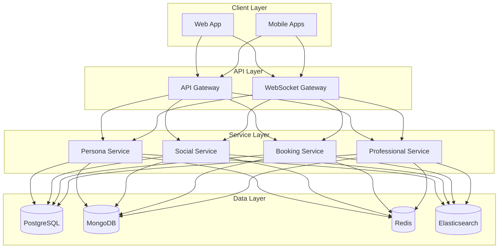

## 2.3 Technical Decisions

### 2.3.1 Architecture Patterns

| Pattern | Implementation | Justification |
|---------|---------------|---------------|
| Microservices | Domain-driven bounded contexts | Scalability and team autonomy |
| Event-driven | Apache Kafka message bus | Loose coupling and reliability |
| CQRS | Separate read/write models | Performance optimization |
| API Gateway | Kong with custom plugins | Security and protocol translation |
| Circuit Breaker | Netflix Hystrix | Fault tolerance |

### 2.3.2 Deployment Architecture

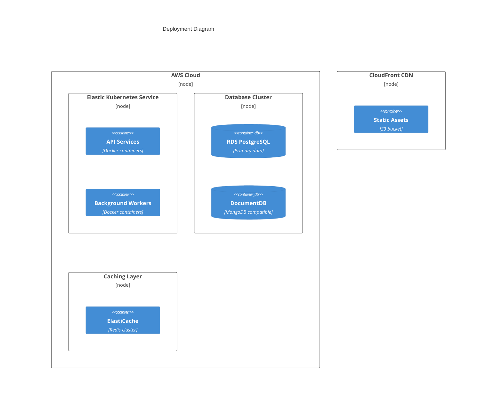

## 2.4 Cross-Cutting Concerns

### 2.4.1 Monitoring and Observability

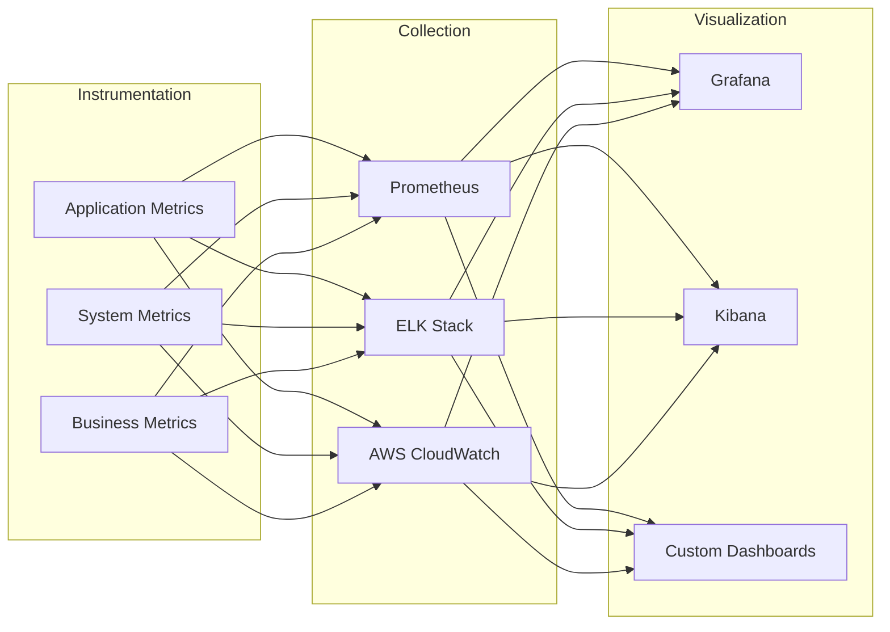

### 2.4.2 Security Architecture

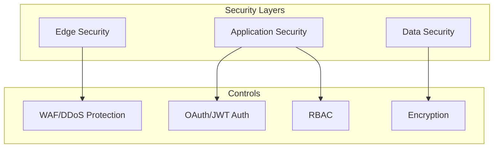

### 2.4.3 Disaster Recovery

| Component | RPO | RTO | Strategy |
|-----------|-----|-----|----------|
| User Data | 1 hour | 4 hours | Multi-region replication |
| Chat History | 24 hours | 2 hours | Daily backups |
| ML Models | 1 week | 6 hours | Version control in S3 |
| Static Assets | 0 | 5 minutes | CDN redundancy |
| Configurations | 0 | 15 minutes | Git-based management |

# 3. SYSTEM COMPONENTS ARCHITECTURE

## 3.1 USER INTERFACE DESIGN

### 3.1.1 Design System Specifications

| Component | Specification | Implementation |
|-----------|--------------|----------------|
| Typography | Roboto for UI, Playfair Display for headings | CSS font-family with system fallbacks |
| Color Palette | Primary: #1A73E8, Secondary: #34A853 | CSS custom properties with HSL values |
| Spacing System | 4px base unit, 8-point grid | SCSS mixins and utility classes |
| Breakpoints | Mobile: 320px, Tablet: 768px, Desktop: 1024px | CSS media queries |
| Accessibility | WCAG 2.1 Level AA | ARIA attributes, semantic HTML |
| Dark Mode | System preference detection | CSS prefers-color-scheme |
| RTL Support | Bidirectional text handling | CSS logical properties |

### 3.1.2 Component Library Structure

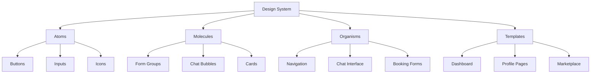

### 3.1.3 Critical User Flows

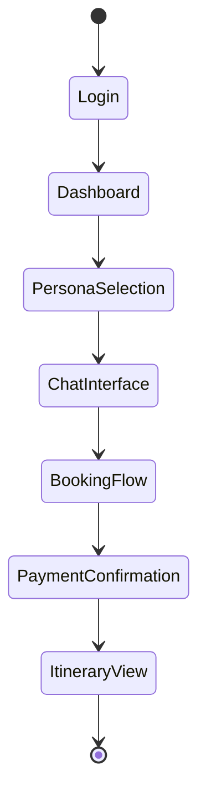

## 3.2 DATABASE DESIGN

### 3.2.1 Entity Relationship Diagram

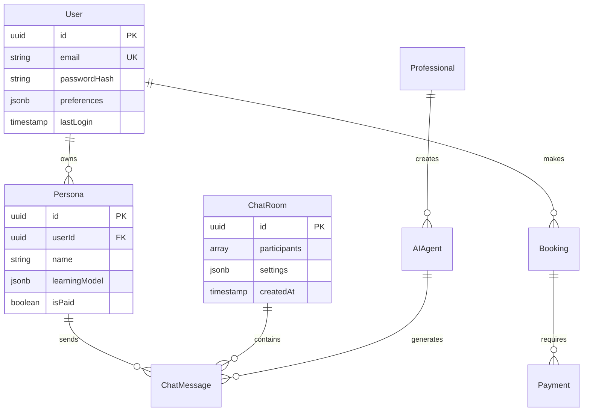

### 3.2.2 Data Management Strategy

| Aspect | Strategy | Implementation |
|--------|----------|----------------|
| Partitioning | Time-based for messages, hash for users | PostgreSQL declarative partitioning |
| Indexing | B-tree for IDs, GiST for location data | Automated index management |
| Caching | Two-level: Redis + Application | Cache-aside pattern with TTL |
| Replication | Multi-region active-passive | PostgreSQL streaming replication |
| Backup | Continuous WAL archiving | pgBackRest with S3 storage |
| Encryption | Column-level for PII | PostgreSQL pgcrypto |

## 3.3 API DESIGN

### 3.3.1 API Architecture

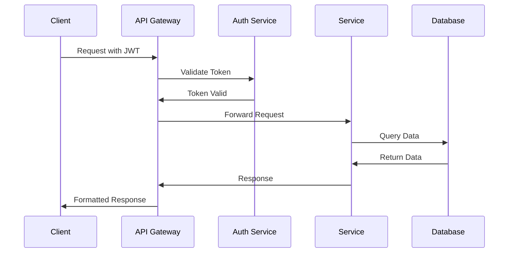

### 3.3.2 API Specifications

| Endpoint Category | Rate Limit | Authentication | Caching |
|------------------|------------|----------------|----------|
| Public Routes | 100/hour | Optional | 1 hour |
| User Routes | 1000/hour | Required | 5 minutes |
| Professional Routes | 5000/hour | Required + Scope | 1 minute |
| System Routes | 10000/hour | Service Account | None |

### 3.3.3 Integration Patterns

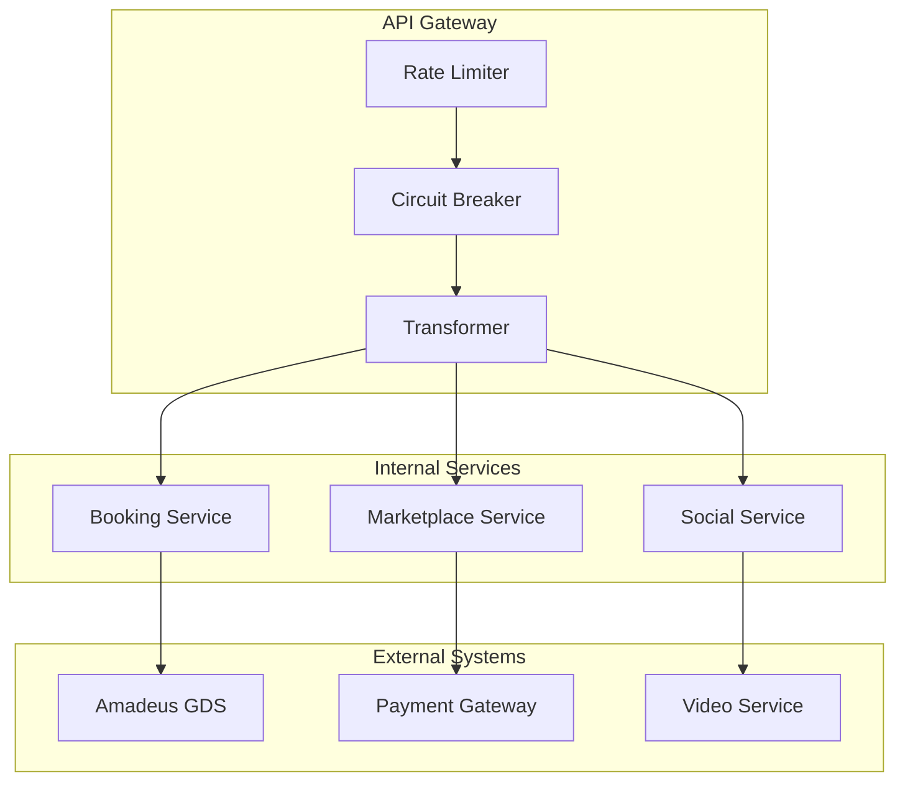

### 3.3.4 Error Handling Strategy

| Error Category | HTTP Code | Retry Strategy | Client Feedback |
|----------------|-----------|----------------|-----------------|
| Validation | 400 | None | Field-level errors |
| Authentication | 401 | Token refresh | Login prompt |
| Authorization | 403 | None | Permission error |
| Resource | 404 | None | User message |
| Rate Limit | 429 | Exponential backoff | Retry-After header |
| Server | 500 | 3x with backoff | Support reference |

# 4. TECHNOLOGY STACK

## 4.1 PROGRAMMING LANGUAGES

| Platform/Component | Language | Version | Justification |
|-------------------|----------|---------|---------------|
| Backend Services | Node.js | 18.x LTS | - Event-driven architecture support<br>- Large ecosystem for travel APIs<br>- Excellent WebSocket performance |
| Frontend Web | TypeScript | 4.9.x | - Type safety for complex UI states<br>- Enhanced IDE support<br>- Better maintainability |
| Mobile Apps | React Native/TypeScript | 0.71.x | - Code sharing with web platform<br>- Native performance<br>- Reduced development time |
| ML Services | Python | 3.9.x | - Rich ML library ecosystem<br>- TensorFlow/PyTorch support<br>- Natural language processing capabilities |
| DevOps Scripts | Go | 1.19.x | - Fast execution<br>- Strong concurrency<br>- Native cloud tooling |

## 4.2 FRAMEWORKS & LIBRARIES

### Core Frameworks

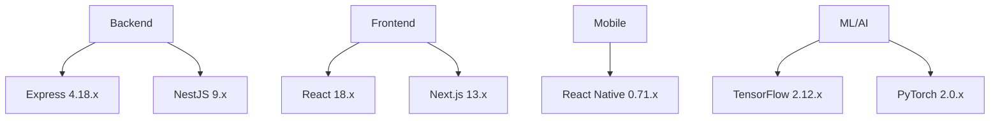

### Supporting Libraries

| Category | Library | Version | Purpose |
|----------|---------|---------|----------|
| State Management | Redux Toolkit | 1.9.x | Centralized state management |
| API Client | Apollo Client | 3.7.x | GraphQL data fetching |
| UI Components | Material-UI | 5.13.x | Design system implementation |
| Real-time | Socket.io | 4.6.x | WebSocket communication |
| Testing | Jest/RTL | 29.5.x | Unit/Integration testing |
| Documentation | Storybook | 7.0.x | Component documentation |

## 4.3 DATABASES & STORAGE

### Data Architecture

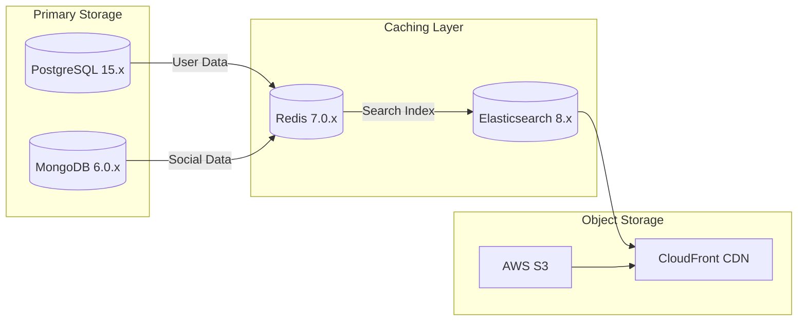

### Storage Strategy

| Data Type | Storage Solution | Justification |
|-----------|-----------------|---------------|
| User Profiles | PostgreSQL | ACID compliance, relational integrity |
| Chat History | MongoDB | Flexible schema, document-based |
| Session Data | Redis | High-performance caching |
| Search Index | Elasticsearch | Full-text search capabilities |
| Media Files | S3 + CloudFront | Global distribution, scalability |
| ML Models | S3 + EFS | Versioning, training data storage |

## 4.4 THIRD-PARTY SERVICES

### Service Integration Architecture

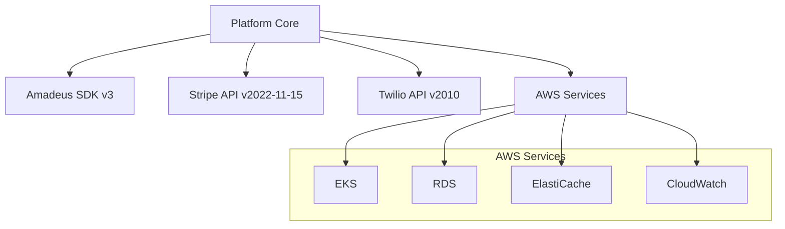

### External Services

| Service Category | Provider | Purpose | SLA |
|-----------------|----------|---------|-----|
| Travel API | Amadeus | Booking engine | 99.95% |
| Payments | Stripe/PayPal | Transaction processing | 99.99% |
| Video | Twilio/Zoom | Consultation calls | 99.9% |
| Email | SendGrid | Transactional emails | 99.99% |
| Analytics | Mixpanel | User behavior tracking | 99.9% |
| Monitoring | DataDog | System monitoring | 99.99% |

## 4.5 DEVELOPMENT & DEPLOYMENT

### CI/CD Pipeline

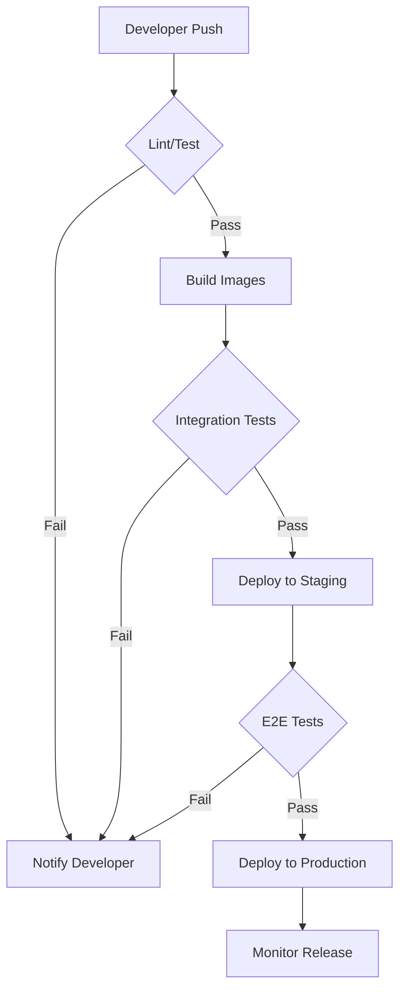

### Development Tools

| Category | Tool | Version | Purpose |
|----------|------|---------|----------|
| IDE | VS Code | Latest | Development environment |
| API Testing | Postman | Latest | API development/testing |
| Containerization | Docker | 20.10.x | Application packaging |
| Orchestration | Kubernetes | 1.26.x | Container orchestration |
| IaC | Terraform | 1.4.x | Infrastructure management |
| Monitoring | Prometheus | 2.42.x | Metrics collection |
| Logging | ELK Stack | 8.7.x | Log aggregation |

# 5. SYSTEM DESIGN

## 5.1 USER INTERFACE DESIGN

### 5.1.1 Core Layout Structure

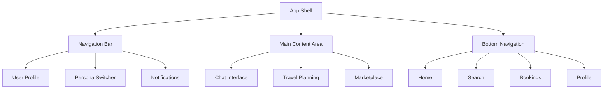

### 5.1.2 Key Interface Components

| Component | Description | Interaction Pattern |
|-----------|-------------|-------------------|
| Persona Switcher | Carousel of active personas with quick-switch | Horizontal swipe, tap to activate |
| Chat Interface | Split view with participant list and messages | Expandable panels, infinite scroll |
| Travel Planner | Multi-step wizard with collaborative features | Progress indicator, drag-drop |
| Marketplace | Grid layout with filtering and search | Infinite scroll, filter chips |

### 5.1.3 Responsive Breakpoints

| Breakpoint | Layout Changes | Component Behavior |
|------------|----------------|-------------------|
| Mobile (<768px) | Single column, bottom nav | Collapsible panels, modal dialogs |
| Tablet (768-1024px) | Two column, side nav | Split view, slide-over panels |
| Desktop (>1024px) | Three column, persistent nav | Multi-pane layout, inline dialogs |

## 5.2 DATABASE DESIGN

### 5.2.1 Schema Architecture

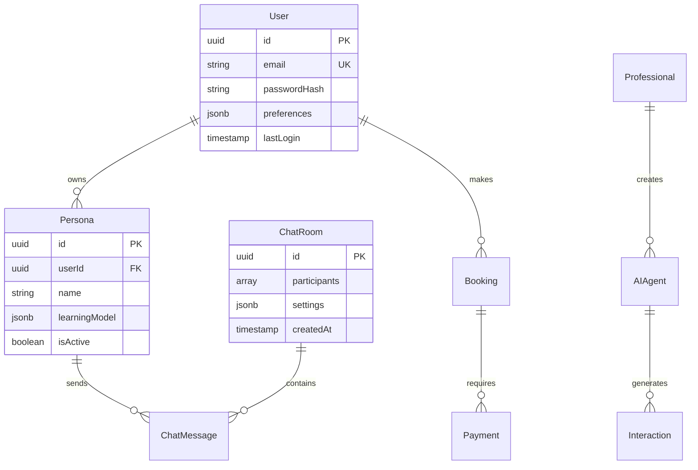

### 5.2.2 Data Partitioning Strategy

| Data Type | Partitioning Method | Retention Policy |
|-----------|-------------------|------------------|
| Chat Messages | Time-based (monthly) | 12 months rolling |
| User Profiles | Hash-based (user ID) | Permanent |
| Booking Records | Range-based (date) | 7 years |
| Analytics Data | Time-based (daily) | 24 months |

### 5.2.3 Indexing Strategy

| Collection | Index Type | Fields | Purpose |
|------------|------------|--------|---------|
| Users | B-tree | email, username | Login lookup |
| ChatMessages | Time-series | roomId, timestamp | Message retrieval |
| Bookings | Composite | userId, status, date | Booking management |
| AIAgents | Text | description, tags | Search functionality |

## 5.3 API DESIGN

### 5.3.1 API Architecture

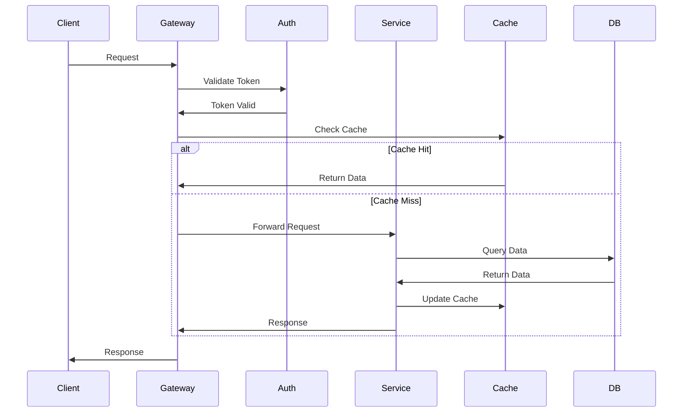

### 5.3.2 API Endpoints

| Category | Endpoint | Method | Purpose |
|----------|----------|--------|---------|
| Auth | /api/v1/auth/login | POST | User authentication |
| Personas | /api/v1/personas | GET/POST | Persona management |
| Chat | /api/v1/chat/rooms | GET/POST | Chat room operations |
| Booking | /api/v1/bookings | GET/POST | Travel bookings |
| Marketplace | /api/v1/marketplace | GET | Professional listings |

### 5.3.3 WebSocket Events

| Event | Direction | Payload | Purpose |
|-------|-----------|---------|---------|
| chat.message | Bidirectional | {roomId, content, sender} | Real-time messaging |
| persona.switch | Client->Server | {personaId} | Persona activation |
| booking.update | Server->Client | {bookingId, status} | Booking notifications |
| typing.indicator | Bidirectional | {roomId, userId} | Chat typing status |

### 5.3.4 Error Handling

| Error Category | HTTP Code | Response Format |
|----------------|-----------|-----------------|
| Validation | 400 | {errors: [{field, message}]} |
| Authentication | 401 | {error: "message"} |
| Authorization | 403 | {error: "message"} |
| Resource | 404 | {error: "message"} |
| Server | 500 | {error: "reference_id"} |

# 6. USER INTERFACE DESIGN

## 6.1 Design System Components

### Icon Key
```
[?] - Help/Information tooltip
[$] - Payment/Financial action
[i] - Information display
[+] - Add/Create new item
[x] - Close/Delete/Remove
[<] [>] - Navigation controls
[^] - Upload functionality
[#] - Menu/Dashboard access
[@] - User profile/Account
[!] - Alert/Warning message
[=] - Settings/Menu toggle
[*] - Favorite/Important marker
```

### Input Elements
```
[ ] - Checkbox
( ) - Radio button
[...] - Text input field
[v] - Dropdown selector
[Button] - Clickable button
[====] - Progress indicator
```

## 6.2 Core Layouts

### 6.2.1 Main Dashboard
```
+----------------------------------------------------------+
|  [#] AI Travel Platform             [@] Profile  [?] Help  |
+----------------------------------------------------------+
|  +----------------+  +----------------------------------+  |
|  | Active Persona |  | Current Chats                    |  |
|  | [@] Explorer   |  | +------------------------------+ |  |
|  | [*] Adventure  |  | | [i] Travel Group Chat        | |  |
|  | [*] Luxury     |  | | [@] John, [@] Sarah, [AI]    | |  |
|  | [+] Add New    |  | +------------------------------+ |  |
|  +----------------+  | [+] Start New Chat              | |  |
|  |                |  +----------------------------------+  |
|  | [$] Credits: 50|                                       |
|  +----------------+                                       |
|                                                          |
|  +--------------------------------------------------+   |
|  | Recent Bookings                                   |   |
|  | [i] Paris Trip - Jun 15-20 [*]                   |   |
|  | [i] Tokyo Hotels - Pending [$]                    |   |
|  +--------------------------------------------------+   |
+----------------------------------------------------------+
```

### 6.2.2 Chat Interface
```
+----------------------------------------------------------+
| [<] Back  Chat: Adventure Planning                    [x]  |
+----------------------------------------------------------+
|  +---------------+  +--------------------------------+     |
|  | Participants  |  |     June 15, 2024              |     |
|  | [@] You       |  | [@] You: Looking for hotels    |     |
|  | [@] Sarah     |  | [AI] Adventure: Here are top 3:|     |
|  | [AI] Adventure|  | +----------------------------+ |     |
|  | [+] Add       |  | | 1. Mountain Lodge [$199]   | |     |
|  +---------------+  | | 2. Forest Cabin  [$150]    | |     |
|                    | | 3. Lake Resort  [$225]      | |     |
|                    | +----------------------------+ |     |
|                    | [@] Sarah: I like option 1!    |     |
|                    +--------------------------------+     |
|                    | [...........................] [Send] |
+----------------------------------------------------------+
```

### 6.2.3 Booking Interface
```
+----------------------------------------------------------+
| [<] Back  Book: Mountain Lodge                      [$]   |
+----------------------------------------------------------+
|  +--------------------------------------------------+    |
|  | Reservation Details                               |    |
|  | Check-in:  [...] [v]                             |    |
|  | Check-out: [...] [v]                             |    |
|  | Guests:    [v] Adults  [v] Children              |    |
|  +--------------------------------------------------+    |
|                                                          |
|  +--------------------------------------------------+    |
|  | Payment Split                                     |    |
|  | [ ] Split payment with group                      |    |
|  | [@] You:     [$100]                              |    |
|  | [@] Sarah:   [$99]                               |    |
|  +--------------------------------------------------+    |
|                                                          |
|  Total: $199                     [Confirm Booking]       |
+----------------------------------------------------------+
```

### 6.2.4 Professional Dashboard
```
+----------------------------------------------------------+
| [#] Professional Portal         [$] Revenue  [=] Settings  |
+----------------------------------------------------------+
|  +----------------+  +----------------------------------+  |
|  | AI Agents      |  | Active Consultations             |  |
|  | [AI] Local Pro |  | +------------------------------+ |  |
|  | [AI] Food Guide|  | | [@] Client: John Smith       | |  |
|  | [+] Create New |  | | [!] Starting in 15 minutes   | |  |
|  +----------------+  | | [Join Meeting]               | |  |
|                     | +------------------------------+ |  |
|  +----------------+ | [v] View All Bookings          | |  |
|  | Analytics      | +----------------------------------+  |
|  | Users: 1.2k    |                                      |
|  | Rating: 4.8    | +----------------------------------+  |
|  | Income: $2.5k  | | Recent Reviews                   |  |
|  +----------------+ | [*][*][*][*][*] Great advice!    |  |
+----------------------------------------------------------+
```

## 6.3 Responsive Breakpoints

| Screen Size | Layout Adjustments |
|-------------|-------------------|
| Mobile (<768px) | Single column, collapsible menus |
| Tablet (768-1024px) | Two column, side panel overlay |
| Desktop (>1024px) | Three column, persistent panels |

## 6.4 Component States

### Button States
```
[Button]           - Default
[Button]*          - Hover
[Button]'          - Active/Pressed
[Button]_          - Disabled
```

### Input States
```
[.............]   - Empty
[Hello World..]   - With content
[.............]!  - Error
[.............]?  - Help/Tooltip visible
```

### Alert Types
```
[!] Error:   +------------------------+
             | Critical error message |
             +------------------------+

[i] Info:    +------------------------+
             | Information message    |
             +------------------------+

[*] Success: +------------------------+
             | Success message       |
             +------------------------+
```

# 7. SECURITY CONSIDERATIONS

## 7.1 AUTHENTICATION AND AUTHORIZATION

### 7.1.1 Authentication Methods

| Method | Implementation | Use Case |
|--------|----------------|-----------|
| OAuth 2.0 + JWT | Auth0 with RS256 signing | Primary user authentication |
| API Keys | SHA-256 hashed keys | Professional API access |
| MFA | TOTP via Auth0 Guardian | Professional accounts, high-value transactions |
| Social Auth | OAuth integration with major providers | Optional user signup |
| Session Management | Redis with 30-minute TTL | Active session tracking |

### 7.1.2 Authorization Model

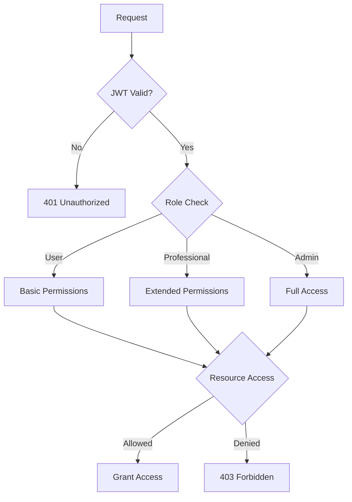

### 7.1.3 Role-Based Access Control (RBAC)

| Role | Permissions | Access Level |
|------|------------|--------------|
| User | Create/manage personas, book travel, participate in chats | Basic |
| Professional | Create AI agents, manage consultations, access analytics | Extended |
| Admin | System configuration, user management, full analytics | Full |
| Service Account | API access, automated operations | Limited |

## 7.2 DATA SECURITY

### 7.2.1 Encryption Standards

| Data State | Method | Implementation |
|------------|--------|----------------|
| In Transit | TLS 1.3 | Nginx/CloudFront configuration |
| At Rest | AES-256-GCM | AWS KMS integration |
| Database | Column-level encryption | pgcrypto extension |
| Backups | AES-256 with unique keys | AWS S3 server-side encryption |
| Chat Messages | End-to-end encryption | Signal Protocol implementation |

### 7.2.2 Data Classification

| Classification | Examples | Security Measures |
|----------------|----------|------------------|
| Public | Travel listings, AI agent profiles | Basic encryption |
| Internal | Chat logs, booking details | Enhanced encryption, access controls |
| Sensitive | Payment data, personal information | Maximum encryption, strict access |
| Regulated | PCI data, health information | Isolated storage, audit logging |

### 7.2.3 Key Management

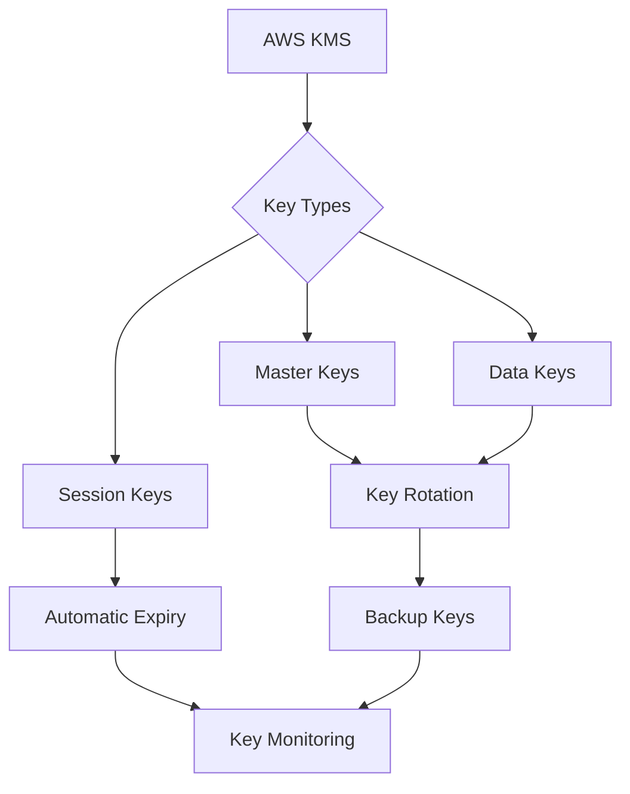

## 7.3 SECURITY PROTOCOLS

### 7.3.1 Network Security

```mermaid
flowchart TD
    A[Internet] --> B[CloudFront WAF]
    B --> C[Load Balancer]
    C --> D[API Gateway]
    D --> E{Security Layers}
    E --> F[Rate Limiting]
    E --> G[DDoS Protection]
    E --> H[IP Filtering]
    F & G & H --> I[Application Servers]
    I --> J[Internal Network]
```

### 7.3.2 Security Monitoring

| Component | Tool | Purpose |
|-----------|------|---------|
| Log Analysis | ELK Stack | Security event monitoring |
| Intrusion Detection | AWS GuardDuty | Threat detection |
| Vulnerability Scanning | AWS Inspector | Security assessment |
| DDoS Protection | AWS Shield | Attack mitigation |
| Security Information | AWS SecurityHub | Centralized security management |

### 7.3.3 Compliance Controls

| Requirement | Implementation | Validation |
|-------------|----------------|------------|
| GDPR | Data encryption, consent management | Regular audits |
| PCI DSS | Isolated payment processing | Quarterly scans |
| SOC 2 | Access controls, monitoring | Annual certification |
| CCPA | Data privacy controls | Compliance review |
| HIPAA | PHI protection measures | Security assessment |

### 7.3.4 Incident Response

```mermaid
stateDiagram-v2
    [*] --> Detection
    Detection --> Analysis
    Analysis --> Containment
    Containment --> Eradication
    Eradication --> Recovery
    Recovery --> PostIncident
    PostIncident --> [*]
```

| Phase | Actions | Responsible Team |
|-------|---------|-----------------|
| Detection | Monitor alerts, identify threats | Security Operations |
| Analysis | Assess impact, determine scope | Security Analysis |
| Containment | Isolate affected systems | Infrastructure Team |
| Eradication | Remove threat, patch vulnerabilities | Security Engineering |
| Recovery | Restore services, verify security | Operations Team |
| Post-Incident | Document lessons, update procedures | Security Management |

# 8. INFRASTRUCTURE

## 8.1 DEPLOYMENT ENVIRONMENT

### 8.1.1 Environment Strategy

| Environment | Purpose | Configuration |
|-------------|---------|---------------|
| Development | Local development and testing | Docker Compose, minikube |
| Staging | Pre-production testing | AWS EKS, reduced capacity |
| Production | Live system | Multi-region AWS EKS |
| DR Site | Disaster recovery | Cross-region AWS failover |

### 8.1.2 Regional Distribution

```mermaid
flowchart TD
    subgraph Primary Region
        A[US-East Load Balancer]
        B[EKS Cluster]
        C[RDS Primary]
        D[ElastiCache]
    end
    
    subgraph Secondary Region
        E[US-West Load Balancer]
        F[EKS Cluster]
        G[RDS Replica]
        H[ElastiCache]
    end
    
    subgraph EU Region
        I[EU Load Balancer]
        J[EKS Cluster]
        K[RDS Replica]
        L[ElastiCache]
    end
    
    A --> B
    B --> C
    B --> D
    E --> F
    F --> G
    F --> H
    I --> J
    J --> K
    J --> L
    
    C --> G
    C --> K
```

## 8.2 CLOUD SERVICES

### 8.2.1 AWS Service Configuration

| Service | Usage | Configuration |
|---------|-------|--------------|
| EKS | Container orchestration | 1.26.x, managed node groups |
| RDS | PostgreSQL databases | Multi-AZ, 15.x |
| DocumentDB | MongoDB workloads | 5.0 compatible |
| ElastiCache | Redis caching | Cluster mode enabled |
| S3 | Object storage | Versioning enabled |
| CloudFront | CDN | Edge locations worldwide |
| Route53 | DNS management | Latency-based routing |
| ACM | SSL/TLS certificates | Auto-renewal enabled |

### 8.2.2 Resource Scaling

```mermaid
flowchart LR
    subgraph Auto Scaling
        A[EKS Node Groups]
        B[RDS Read Replicas]
        C[ElastiCache Shards]
    end
    
    subgraph Metrics
        D[CPU Utilization]
        E[Memory Usage]
        F[Connection Count]
    end
    
    subgraph Thresholds
        G[Scale Out: 70%]
        H[Scale In: 30%]
    end
    
    D & E & F --> G & H
    G & H --> A & B & C
```

## 8.3 CONTAINERIZATION

### 8.3.1 Docker Configuration

| Component | Base Image | Size Optimization |
|-----------|------------|------------------|
| API Services | node:18-alpine | Multi-stage builds |
| ML Services | python:3.9-slim | Minimal dependencies |
| Frontend | nginx:alpine | Build-time optimization |
| Workers | node:18-alpine | Layer caching |

### 8.3.2 Container Architecture

```mermaid
flowchart TD
    subgraph Docker Images
        A[API Service]
        B[ML Service]
        C[Frontend]
        D[Worker]
    end
    
    subgraph Shared Resources
        E[Config Volume]
        F[Secrets Volume]
        G[Persistent Storage]
    end
    
    A & B & C & D --> E
    A & B & C & D --> F
    A & B & D --> G
```

## 8.4 ORCHESTRATION

### 8.4.1 Kubernetes Configuration

| Resource Type | Configuration | Scaling Strategy |
|---------------|--------------|------------------|
| Deployments | Rolling updates | HPA based on CPU/Memory |
| StatefulSets | For databases | Manual scaling |
| DaemonSets | For monitoring | Node-based |
| Services | LoadBalancer/ClusterIP | Regional distribution |
| Ingress | nginx-ingress | SSL termination |

### 8.4.2 Cluster Architecture

```mermaid
flowchart TD
    subgraph EKS Cluster
        A[Ingress Controller]
        B[Service Mesh]
        
        subgraph Workloads
            C[API Pods]
            D[ML Pods]
            E[Worker Pods]
        end
        
        subgraph Platform Services
            F[Monitoring]
            G[Logging]
            H[Service Discovery]
        end
    end
    
    A --> B
    B --> C & D & E
    F & G & H --> C & D & E
```

## 8.5 CI/CD PIPELINE

### 8.5.1 Pipeline Stages

```mermaid
flowchart LR
    A[Code Push] --> B[Lint/Test]
    B --> C[Build Images]
    C --> D[Security Scan]
    D --> E[Deploy Staging]
    E --> F[Integration Tests]
    F --> G[Deploy Production]
    G --> H[Health Check]
    
    style A fill:#f9f,stroke:#333
    style G fill:#9f9,stroke:#333
```

### 8.5.2 Pipeline Configuration

| Stage | Tools | SLA |
|-------|-------|-----|
| Source Control | GitHub Enterprise | 99.9% uptime |
| CI Platform | GitHub Actions | 5-minute build time |
| Container Registry | ECR | 99.9% availability |
| Security Scanning | Snyk, Trivy | < 10-minute scan |
| Deployment | ArgoCD | < 15-minute rollout |
| Monitoring | Prometheus/Grafana | Real-time metrics |

### 8.5.3 Deployment Strategy

| Environment | Strategy | Rollback Time |
|-------------|----------|---------------|
| Staging | Blue/Green | < 5 minutes |
| Production | Canary | < 2 minutes |
| Hotfix | Rolling Update | < 1 minute |
| DR Failover | Regional Switch | < 5 minutes |

# 8. APPENDICES

## 8.1 ADDITIONAL TECHNICAL INFORMATION

### 8.1.1 Machine Learning Model Specifications

| Model Type | Framework | Training Frequency | Purpose |
|------------|-----------|-------------------|----------|
| Recommendation Engine | TensorFlow 2.12.x | Daily incremental | Persona-based suggestions |
| NLP Chat Model | PyTorch 2.0.x | Weekly full retrain | AI agent conversations |
| Sentiment Analysis | TensorFlow Lite | Real-time | User satisfaction tracking |
| Anomaly Detection | Scikit-learn 1.2.x | Hourly updates | Fraud prevention |

### 8.1.2 Caching Strategy

```mermaid
flowchart TD
    A[Request] --> B{Cache Check}
    B -->|Hit| C[Return Cached]
    B -->|Miss| D[Fetch Data]
    D --> E[Process]
    E --> F[Cache Result]
    F --> G[Return Fresh]
    
    subgraph Cache Layers
    H[Browser Cache]
    I[CDN Cache]
    J[API Cache]
    K[Database Cache]
    end
    
    H -.-> I -.-> J -.-> K
```

### 8.1.3 Error Handling Matrix

| Error Type | HTTP Code | Retry Strategy | Cache Impact |
|------------|-----------|----------------|--------------|
| Validation | 400 | None | No cache |
| Rate Limit | 429 | Exponential backoff | Preserve cache |
| GDS Timeout | 504 | 3x retry | Clear cache |
| ML Error | 422 | Fallback model | Stale cache |
| Auth Error | 401 | Token refresh | Clear auth cache |

## 8.2 GLOSSARY

| Term | Definition |
|------|------------|
| Bounded Context | Domain-driven design concept defining functional boundaries |
| Circuit Breaker | Design pattern preventing cascading failures |
| Dark Launch | Technique to deploy features without user visibility |
| Edge Computing | Processing data near the source of generation |
| Feature Flag | Configuration enabling selective feature activation |
| Hot Reload | Development feature for real-time code updates |
| Idempotency | Property ensuring same result for repeated operations |
| Kubernetes Pod | Smallest deployable unit in container orchestration |
| Load Shedding | Controlled reduction of system load |
| Materialized View | Pre-computed database query result |
| Saga Pattern | Distributed transactions management approach |
| Service Mesh | Infrastructure layer for service-to-service communication |
| Sticky Session | Load balancing strategy maintaining user connection |
| Throttling | Rate limiting mechanism for API calls |
| Zero Trust | Security model requiring verification of every request |

## 8.3 ACRONYMS

| Acronym | Full Form |
|---------|-----------|
| ACID | Atomicity, Consistency, Isolation, Durability |
| AES | Advanced Encryption Standard |
| CORS | Cross-Origin Resource Sharing |
| CQRS | Command Query Responsibility Segregation |
| DDD | Domain-Driven Design |
| DDoS | Distributed Denial of Service |
| EKS | Elastic Kubernetes Service |
| ETL | Extract, Transform, Load |
| GSLB | Global Server Load Balancing |
| HAProxy | High Availability Proxy |
| HMAC | Hash-based Message Authentication Code |
| IOPS | Input/Output Operations Per Second |
| JWE | JSON Web Encryption |
| MTBF | Mean Time Between Failures |
| MTTR | Mean Time To Recovery |
| ORM | Object-Relational Mapping |
| OWASP | Open Web Application Security Project |
| RDS | Relational Database Service |
| RPO | Recovery Point Objective |
| RTO | Recovery Time Objective |
| SLA | Service Level Agreement |
| SLO | Service Level Objective |
| SSE | Server-Sent Events |
| SSO | Single Sign-On |
| TTL | Time To Live |
| UUID | Universally Unique Identifier |
| VPC | Virtual Private Cloud |
| WAF | Web Application Firewall |
| XSS | Cross-Site Scripting |
| YAML | YAML Ain't Markup Language |