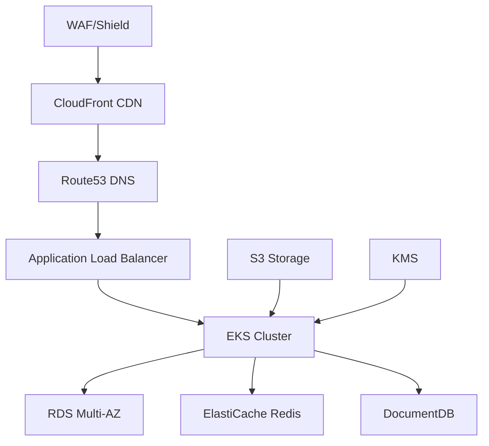
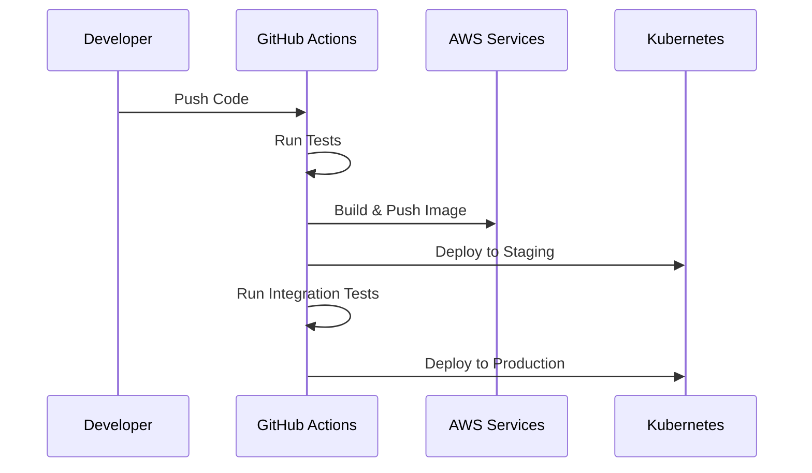
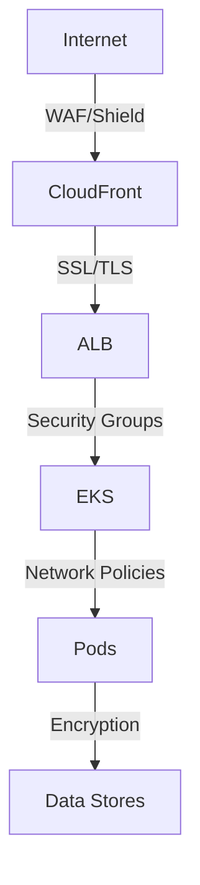

# AI-Enhanced Social Travel Platform Infrastructure Documentation


**Version:** 1.0.0  
**Last Updated:** 2024-01-20  
**Maintainers:** Platform Engineering Team  
**Review Frequency:** Quarterly  
**Next Review:** 2024-04-20

## Table of Contents
- [Overview](#overview)
- [Prerequisites](#prerequisites)
- [Infrastructure Components](#infrastructure-components)
- [Deployment Procedures](#deployment-procedures)
- [Security and Compliance](#security-and-compliance)
- [Maintenance](#maintenance)

## Overview

The AI-Enhanced Social Travel Platform infrastructure is built on AWS with a focus on high availability, scalability, and security. The architecture employs containerized microservices orchestrated by Kubernetes (EKS), with multi-region deployment capabilities and comprehensive monitoring.

### Architecture Overview



## Prerequisites

### Required Tools
- AWS CLI v2.x
- kubectl v1.26.x
- Terraform v1.4.x
- Helm v3.x
- Docker v20.10.x

### Access Requirements
- AWS IAM credentials with appropriate permissions
- kubectl configuration for EKS clusters
- GitHub repository access
- Docker registry credentials

### Environment Variables
```bash
export AWS_PROFILE=social-travel-platform
export AWS_REGION=us-east-1
export KUBECONFIG=~/.kube/social-travel-config
```

## Infrastructure Components

### AWS Services Configuration

#### EKS Cluster
```hcl
module "eks" {
  source          = "terraform-aws-modules/eks/aws"
  version         = "19.x"
  cluster_name    = "social-travel-${var.environment}"
  cluster_version = "1.26"
  
  vpc_id          = module.vpc.vpc_id
  subnet_ids      = module.vpc.private_subnets
  
  node_groups = {
    application = {
      desired_capacity = 3
      max_capacity     = 10
      min_capacity    = 2
      instance_types  = ["m5.large"]
    }
    ml_workloads = {
      desired_capacity = 2
      max_capacity     = 5
      min_capacity    = 1
      instance_types  = ["g4dn.xlarge"]
    }
  }
}
```

#### RDS Configuration
```hcl
module "rds" {
  source  = "terraform-aws-modules/rds/aws"
  version = "5.x"
  
  identifier = "social-travel-${var.environment}"
  engine     = "postgres"
  engine_version = "15.x"
  
  multi_az = true
  backup_retention_period = 7
  
  allocated_storage = 100
  storage_encrypted = true
  
  instance_class = "db.r6g.large"
}
```

### Kubernetes Resources

#### Base Configuration
```yaml
apiVersion: v1
kind: Namespace
metadata:
  name: social-travel
  labels:
    environment: production
    app: social-travel-platform

---
apiVersion: networking.k8s.io/v1
kind: NetworkPolicy
metadata:
  name: default-deny
spec:
  podSelector: {}
  policyTypes:
  - Ingress
  - Egress
```

### Monitoring Stack

#### Prometheus Configuration
```yaml
global:
  scrape_interval: 15s
  evaluation_interval: 15s

rule_files:
  - /etc/prometheus/rules/*.yaml

alerting:
  alertmanagers:
    - static_configs:
        - targets:
          - alertmanager:9093

scrape_configs:
  - job_name: 'kubernetes-pods'
    kubernetes_sd_configs:
      - role: pod
```

## Deployment Procedures

### Environment Setup

1. Initialize Terraform workspace:
```bash
terraform init -backend-config=environments/${ENV}/backend.hcl
```

2. Apply infrastructure changes:
```bash
terraform plan -var-file=environments/${ENV}/terraform.tfvars
terraform apply -var-file=environments/${ENV}/terraform.tfvars
```

3. Configure Kubernetes resources:
```bash
kubectl apply -k kubernetes/overlays/${ENV}
```

### Deployment Pipeline



### Validation Procedures

- Health Check Matrix:
```
✓ DNS Resolution
✓ SSL Certificate Validity
✓ API Endpoint Response
✓ Database Connectivity
✓ Cache Response Time
✓ Message Queue Status
```

## Security and Compliance

### Access Control

#### IAM Roles Matrix

| Role | Purpose | Access Level |
|------|---------|--------------|
| Platform-Admin | Infrastructure management | Full access |
| Developer | Development and debugging | Read + Limited Write |
| CI-CD | Automated deployments | Deployment only |
| Monitoring | Metrics collection | Read only |

### Network Security



## Maintenance

### Backup Procedures

#### Database Backups
- Automated daily snapshots
- Point-in-time recovery enabled
- Cross-region backup replication
- Monthly backup validation

#### Disaster Recovery

| Component | RPO | RTO | Strategy |
|-----------|-----|-----|----------|
| Database | 1 hour | 4 hours | Multi-AZ + Replication |
| File Storage | 24 hours | 2 hours | S3 Cross-Region |
| Cache | N/A | 30 mins | Redis Cluster |
| Kubernetes | 12 hours | 1 hour | EKS Backup |

### Scaling Guidelines

#### Horizontal Pod Autoscaling
```yaml
apiVersion: autoscaling/v2
kind: HorizontalPodAutoscaler
metadata:
  name: api-service
spec:
  scaleTargetRef:
    apiVersion: apps/v1
    kind: Deployment
    name: api-service
  minReplicas: 3
  maxReplicas: 10
  metrics:
  - type: Resource
    resource:
      name: cpu
      target:
        type: Utilization
        averageUtilization: 70
```

### Incident Response

#### Severity Levels

| Level | Description | Response Time | Escalation |
|-------|-------------|---------------|------------|
| P1 | Service Down | 15 mins | Immediate |
| P2 | Degraded Performance | 30 mins | 1 hour |
| P3 | Minor Issue | 2 hours | 4 hours |
| P4 | Non-critical | 8 hours | 24 hours |

---

## Change Log

### Version 1.0.0 (2024-01-20)
- Initial comprehensive documentation
- Complete infrastructure setup guidelines
- Detailed deployment procedures
- Security and compliance documentation
- Maintenance and scaling guidelines