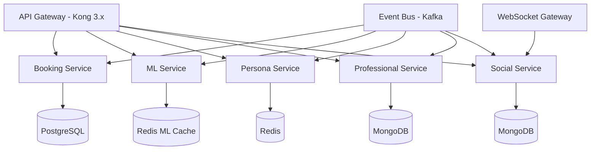
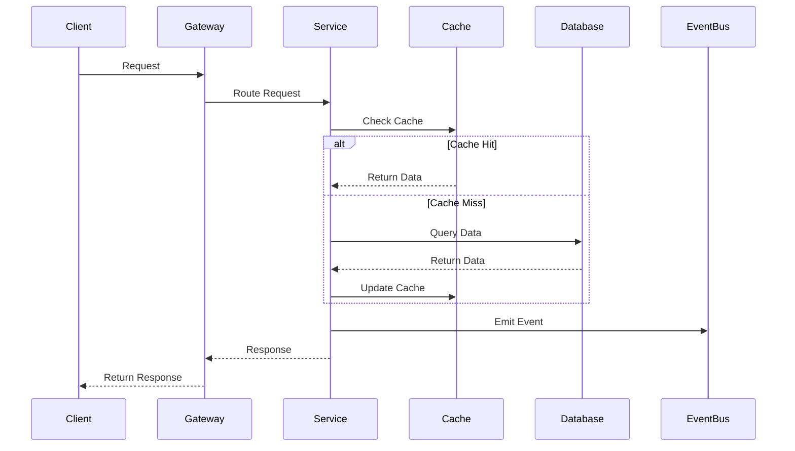
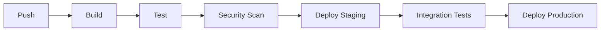

# AI-Enhanced Social Travel Platform - Backend Services

<!-- toc -->
- [Introduction](#introduction)
- [Prerequisites](#prerequisites)
- [Architecture](#architecture)
  * [System Overview](#system-overview)
  * [Core Services](#core-services)
  * [Data Flow](#data-flow)
- [Development](#development)
  * [Getting Started](#getting-started)
  * [Local Development](#local-development)
  * [API Documentation](#api-documentation)
- [Deployment](#deployment)
  * [Environments](#environments)
  * [CI/CD Pipeline](#cicd-pipeline)
  * [Infrastructure](#infrastructure)
- [Security](#security)
- [Monitoring](#monitoring)
- [Contributing](#contributing)
<!-- tocstop -->

## Introduction

The AI-Enhanced Social Travel Platform backend is a robust, scalable microservices ecosystem that powers personalized travel experiences through AI, real-time social interactions, and professional services integration. This documentation provides comprehensive guidelines for development, deployment, and maintenance of the platform's backend services.

## Prerequisites

- Node.js >= 18.0.0 LTS
- Docker >= 20.10.x and Docker Compose >= 2.0.0
- PostgreSQL 15.x with PostGIS extensions
- Redis 7.0.x with RedisJSON module
- MongoDB 6.0.x with replica set configuration
- Python 3.9.x with ML libraries
  - TensorFlow 2.12.x
  - PyTorch 2.0.x
- Kubernetes CLI (kubectl) >= 1.26.x
- AWS CLI >= 2.0.0

## Architecture

### System Overview



### Core Services

| Service | Technology Stack | Purpose | Scaling Strategy |
|---------|-----------------|---------|------------------|
| API Gateway | Kong 3.x | Request routing, auth, rate limiting | Horizontal with load balancing |
| Booking Service | Node.js/Express | Travel reservations via Amadeus | Horizontal with distributed locking |
| ML Service | Python/FastAPI | AI model inference and training | Vertical for GPU, horizontal for API |
| Persona Service | Node.js/NestJS | AI persona management | Horizontal with Redis clustering |
| Professional Service | Node.js/Express | Marketplace operations | Horizontal with sharding |
| Social Service | Node.js/NestJS | Real-time communication | Horizontal with sticky sessions |

### Data Flow



## Development

### Getting Started

1. Clone the repository and install dependencies:
```bash
git clone <repository-url>
cd src/backend
npm install
```

2. Configure environment variables:
```bash
cp .env.example .env
# Edit .env with your local configuration
```

3. Start the development environment:
```bash
docker-compose up -d
```

### Local Development

Development servers can be started individually or as a complete environment:

```bash
# Start all services
npm run dev

# Start individual service
npm run dev:booking
npm run dev:persona
# etc.
```

Debug configurations are available for VS Code in `.vscode/launch.json`.

### API Documentation

- OpenAPI documentation: http://localhost:3000/api/docs
- Postman collection: `docs/postman/collection.json`
- API versioning follows semantic versioning (v1, v2)

## Deployment

### Environments

| Environment | Infrastructure | Purpose | Scaling |
|-------------|---------------|---------|----------|
| Development | Local Docker | Development and testing | Minimal resources |
| Staging | AWS EKS | Pre-production testing | Reduced capacity |
| Production | Multi-region AWS EKS | Live system | Auto-scaling |
| DR | Cross-region AWS | Disaster recovery | Failover config |

### CI/CD Pipeline



### Infrastructure

Infrastructure is managed using Terraform with AWS EKS:

```bash
# Initialize infrastructure
cd terraform
terraform init
terraform plan
terraform apply
```

## Security

- Authentication: OAuth2/JWT with Auth0
- Authorization: Role-Based Access Control (RBAC)
- Data Encryption: AES-256-GCM at rest, TLS 1.3 in transit
- Compliance: GDPR, PCI DSS, SOC 2

## Monitoring

- Metrics: Prometheus with Grafana dashboards
- Logging: ELK Stack (Elasticsearch, Logstash, Kibana)
- Alerts: Alert Manager with PagerDuty integration
- Tracing: Jaeger distributed tracing

## Contributing

1. Fork the repository
2. Create a feature branch (`git checkout -b feature/amazing-feature`)
3. Commit changes (`git commit -m 'Add amazing feature'`)
4. Push to branch (`git push origin feature/amazing-feature`)
5. Open a Pull Request

### Development Standards

- Code Style: ESLint + Prettier configuration
- Testing: Jest for unit tests, Supertest for integration
- Documentation: JSDoc for code, OpenAPI for APIs
- Commits: Conventional Commits specification

### Code Review Process

1. Automated checks must pass
2. Two approvals required
3. No blocking comments
4. All tests passing
5. Documentation updated

For detailed guidelines, see CONTRIBUTING.md