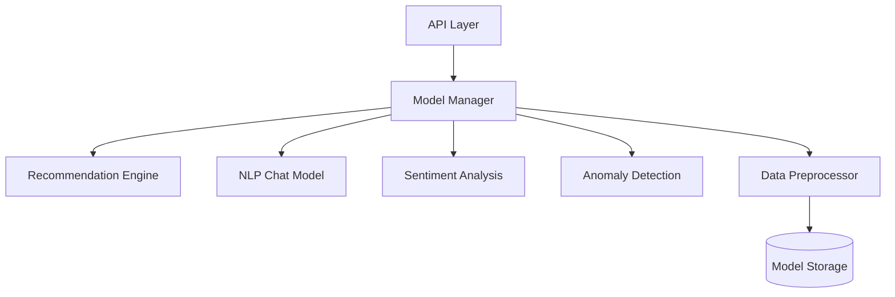
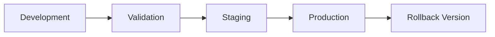
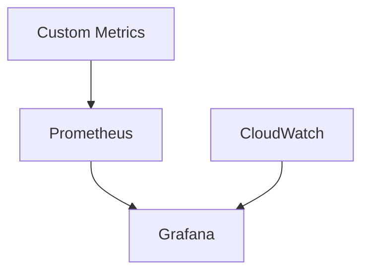

# AI-Enhanced Social Travel Platform - ML Service

## Overview

The ML Service is a core component of the AI-Enhanced Social Travel Platform, providing sophisticated machine learning capabilities for personalized travel recommendations, natural language processing, sentiment analysis, and anomaly detection.

### Service Purpose

- Deliver personalized travel recommendations through advanced AI personas
- Process natural language interactions for AI agent conversations
- Analyze user sentiment for satisfaction tracking
- Detect anomalies for fraud prevention and system health

### Architecture Overview

The service implements a modular architecture with the following components:



### Model Components

| Model | Framework | Version | Purpose |
|-------|-----------|---------|----------|
| Recommendation Engine | TensorFlow | 2.12.x | Persona-based travel suggestions |
| NLP Chat Model | PyTorch | 2.0.x | AI agent conversations |
| Sentiment Analysis | TensorFlow Lite | Latest | User satisfaction tracking |
| Anomaly Detection | scikit-learn | 1.2.x | Fraud prevention |

### Integration Points

- Real-time API endpoints for model inference
- Batch processing for model training
- WebSocket support for streaming predictions
- Event-driven architecture for model updates

## Installation

### Prerequisites

```bash
# Python version
Python 3.9.x

# CUDA support (for GPU acceleration)
CUDA 11.x
cuDNN 8.x
```

### Development Setup

1. Create virtual environment:
```bash
python -m venv venv
source venv/bin/activate  # Linux/Mac
.\venv\Scripts\activate   # Windows
```

2. Install dependencies:
```bash
pip install -r requirements.txt
```

3. Configure environment:
```bash
cp .env.example .env
# Edit .env with your settings
```

### Production Deployment

1. Build Docker image:
```bash
docker build -t ai-travel-ml-service:latest .
```

2. Deploy to Kubernetes:
```bash
kubectl apply -f k8s/
```

## Models

### Recommendation Engine

- **Architecture**: Deep learning with attention mechanism
- **Training Frequency**: Daily incremental
- **Performance Metrics**:
  - NDCG
  - MAP
  - Precision@K
- **Resource Requirements**:
  - GPU Memory: 16GB
  - Training Time: 4 hours
  - Inference Latency: <100ms

### NLP Chat Model

- **Architecture**: Transformer-based with custom attention
- **Training Frequency**: Weekly full retrain
- **Performance Metrics**:
  - BLEU
  - ROUGE
  - Response Time
- **Resource Requirements**:
  - GPU Memory: 32GB
  - Training Time: 24 hours
  - Inference Latency: <200ms

### Sentiment Analysis

- **Architecture**: BERT-based classification
- **Training Frequency**: Real-time
- **Performance Metrics**:
  - Accuracy
  - F1-score
  - Latency
- **Resource Requirements**:
  - GPU Memory: 4GB
  - Training Time: 1 hour
  - Inference Latency: <50ms

### Anomaly Detection

- **Architecture**: Isolation Forest with custom features
- **Training Frequency**: Hourly updates
- **Performance Metrics**:
  - Precision
  - Recall
  - AUC-ROC
- **Resource Requirements**:
  - Memory: 8GB
  - Training Time: 15 minutes
  - Inference Latency: <100ms

### Model Versioning



### A/B Testing Framework

- Configurable traffic splitting
- Automated metric collection
- Statistical significance testing
- Gradual rollout support

### Performance Optimization

- Mixed precision training
- Model quantization
- Batch inference
- Caching strategies

### GPU Resource Management

- Dynamic allocation
- Multi-GPU training
- Resource monitoring
- Auto-scaling support

## Configuration

### Environment Variables

| Variable | Description | Default |
|----------|-------------|---------|
| ML_ENV | Environment (dev/stg/prod) | dev |
| MODEL_PATH | Model storage path | /models |
| LOG_LEVEL | Logging verbosity | INFO |
| GPU_MEMORY_LIMIT | GPU memory limit | 0.8 |

### Model Hyperparameters

```yaml
recommendation_model:
  embedding_dim: 256
  learning_rate: 0.001
  batch_size: 64
  max_epochs: 100

nlp_model:
  vocab_size: 10000
  max_sequence_length: 512
  transformer_layers: 6
  attention_heads: 8
```

### Training Settings

```yaml
training:
  validation_split: 0.2
  early_stopping_patience: 5
  learning_rate_decay: 0.9
  checkpoint_frequency: 1000
```

### Resource Allocation

| Environment | CPU | Memory | GPU |
|-------------|-----|---------|-----|
| Development | 4 cores | 16GB | 1 GPU |
| Staging | 8 cores | 32GB | 2 GPUs |
| Production | 16 cores | 64GB | 4 GPUs |

### Scaling Parameters

- Horizontal pod autoscaling
- Vertical scaling thresholds
- Load balancing configuration
- Resource quotas

### Environment-specific Settings

```yaml
development:
  debug: true
  profiling: enabled
  monitoring: basic

staging:
  debug: false
  profiling: enabled
  monitoring: full

production:
  debug: false
  profiling: sampling
  monitoring: full
```

## API Reference

### Model Training

```http
POST /api/v1/models/{model_type}/train
Content-Type: application/json

{
  "data_source": "string",
  "parameters": object,
  "incremental": boolean
}
```

### Inference

```http
POST /api/v1/models/{model_type}/predict
Content-Type: application/json

{
  "inputs": array,
  "options": object
}
```

### Model Management

```http
GET /api/v1/models/{model_type}/status
PUT /api/v1/models/{model_type}/deploy
DELETE /api/v1/models/{model_type}
```

### Version Control

```http
GET /api/v1/models/{model_type}/versions
POST /api/v1/models/{model_type}/rollback
```

### Performance Metrics

```http
GET /api/v1/metrics/{model_type}
GET /api/v1/metrics/{model_type}/performance
```

## Development

### Code Structure

```
ml-service/
├── src/
│   ├── models/
│   │   ├── recommendation/
│   │   ├── nlp/
│   │   ├── sentiment/
│   │   └── anomaly/
│   ├── preprocessing/
│   ├── training/
│   ├── inference/
│   └── utils/
├── tests/
├── config/
└── scripts/
```

### Testing

```bash
# Unit tests
pytest tests/unit

# Integration tests
pytest tests/integration

# Performance tests
pytest tests/performance
```

### Model Training

```bash
# Train specific model
python scripts/train.py --model-type recommendation

# Incremental update
python scripts/train.py --model-type nlp --incremental
```

### Deployment

```bash
# Build and push Docker image
./scripts/build.sh

# Deploy to environment
./scripts/deploy.sh staging
```

### Security Protocols

- Model input validation
- Rate limiting
- Authentication/Authorization
- Data encryption

### Access Control

| Role | Permissions |
|------|-------------|
| Admin | Full access |
| DataScientist | Training, metrics |
| Engineer | Inference, monitoring |
| Readonly | Metrics only |

## Monitoring

### Metrics Collection

- Model performance metrics
- Resource utilization
- API latency
- Error rates

### Performance Tracking



### Resource Utilization

- CPU/Memory usage
- GPU utilization
- Network I/O
- Storage metrics

### Model Drift Detection

- Feature distribution monitoring
- Prediction confidence tracking
- Performance degradation alerts
- Automated retraining triggers

### Alert Configuration

```yaml
alerts:
  model_performance:
    threshold: 0.95
    window: 1h
  resource_utilization:
    cpu_threshold: 0.8
    memory_threshold: 0.8
  error_rate:
    threshold: 0.01
    interval: 5m
```

### Maintenance Procedures

1. Regular model evaluation
2. Performance optimization
3. Resource scaling
4. Security updates
5. Backup procedures